 

# Tasarım Kalıpları (Design Patterns)

Tasarım kalıpları, yazılım tasarımında ortaya çıkan yaygın sorunlara yönelik yeniden kullanılabilir çözümlerdir (reusable solutions).

 

---

 

## Tasarım Kalıpları Nedir?

Tasarım kalıpları, yazılım tasarımında, özellikle de nesne yönelimli programlama (OOP) bağlamında (context) ortaya çıkan yaygın sorunlara yönelik yeniden kullanılabilir çözümlerdir. Bu kalıplar, belirli sorun türlerini çözmek için bir şablon (template) veya yapı (structure) sağlayıp geliştiricilerin sürdürülebilir (maintainable) ve verimli (efficient) kod yazmasını kolaylaştırır.

OOP bağlamında (context), tasarım kalıpları karmaşık nesneler oluşturma, nesneler arasındaki ilişkileri yönetme veya nesnelerin belirli davranışlara uymasını sağlama gibi zorlukların ele alınmasına yardımcı olabilir.

 

---

 

## Tasarım Kalıplarının Tarihçesi

Tasarım kalıplarının geçmişi mimarlık alanına kadar uzanmaktadır, ancak 1990'larda yazılım mühendisliği ve geliştirme alanında önemli bir önem kazanmışlardır. Tasarım kalıpları, yazılım tasarımında ortaya çıkan yaygın sorunlara yeniden kullanılabilir çözümler sağlar. Bunlar, çeşitli bağlamlara uyacak şekilde uyarlanabilen belirli sorunları çözmeye yönelik şablonlar olarak görülebilir.

 

1. **Mimari kökenleri (Architectural origins):** Tasarım kalıpları kavramı ilk olarak 1970'lerde bir mimar olan Christopher Alexander tarafından ortaya atılmıştır. "A Pattern Language" adlı kitabında, mimaride tekrarlanan tasarım sorunlarını çözmek için belirli kalıpların nasıl tanımlanabileceğini ve uygulanabileceğini tartışmıştır.

 

2. **Yazılım geliştirmede ortaya çıkış (Emergence in software development):** Bu fikir daha sonra genellikle "Dörtlü Çete" (GoF) olarak anılan bir grup bilgisayar bilimcisi tarafından yazılım mühendisliği için benimsenmiş ve uyarlanmıştır. Onların ufuk açıcı kitabı "Design Patterns: Elements of Reusable Object-Oriented Software" (1994) adlı kitaplarında Erich Gamma, Richard Helm, Ralph Johnson ve John Vlissides nesne yönelimli programlama için 23 tasarım kalıbı sunmuşlardır. Bu kitap bu alanda bir dönüm noktası olmuş ve yazılım geliştirmede tasarım kalıpları kavramını popüler hale getirmiştir.

 

---

 

## Tasarım Kalıplarını Neden Kullanıyoruz?

Tasarım kalıplarını çeşitli nedenlerle kullanırız:

 

#### Yeniden Kullanılabilirlik — Reusability

Tasarım kalıpları, yaygın sorunlara denenmiş ve test edilmiş çözümler sunarak bu sorunları sıfırdan çözmek için gereken zaman ve çabayı azaltır. Yazılım sistemlerinde yeniden kullanılabilirliği ve modülerliği teşvik ederler.

 

#### İyileştirilmiş iletişim — Improved communication

Tasarım kalıpları, geliştiriciler arasında ortak bir kelime dağarcığı ve anlayış sağlayarak tasarım kararları ve çözümleri hakkında daha verimli iletişim kurulmasına olanak tanır.

 

#### En iyi uygulamalar — Best practices

Tasarım kalıpları, deneyimli yazılım geliştiricilerin en iyi uygulamalarını kapsar ve acemilerin onların uzmanlıklarından bir şeyler öğrenmesine olanak tanır.

 

#### Sürdürülebilirlik — Maintainability

Tasarım kalıplarını uygulamak genellikle daha sürdürülebilir bir kod ortaya çıkarır ve gelecekte güncelleme, hata ayıklama ve genişletme işlemlerini kolaylaştırır.

 

#### Daha kolay problem çözme — Easier problem-solving

Tasarım kalıpları, geliştiricilerin karmaşık sorunları daha küçük, daha yönetilebilir bileşenlere ayırmasına yardımcı olabilecek, problem çözmeye yönelik yapılandırılmış bir yaklaşım sağlar.

 

---

 

## Dikkat Edilmesi Gereken Hususlar

Tasarım kalıplarının akıllıca kullanılması ve herkese uyan tek bir çözüm olarak ele alınmaması gerektiğini unutmamak önemlidir. Sorun bağlamına (problem context) uyduklarında uygulanmalı ve geliştiriciler her zaman kullanımlarının ödünleşimlerini (trade-offs) ve potansiyel sonuçlarını göz önünde bulundurmalıdır.

Tasarım kalıplarını mantıklı bir şekilde kullanmanın ve sınırlamalarının farkında olmak önemlidir. Tasarım kalıpları yaygın sorunlara yeniden kullanılabilir çözümler sağlar, ancak belirli bir sorun veya bağlam için her zaman en uygun çözüm olmayabilir. Bir tasarım kalıbının sonuçları dikkate alınmadan uygulanması istenmeyen sonuçlara veya optimal olmayan çözümlere yol açabilir.

İşte bu ifadenin bazı nedenleri:

 

#### Bağlamsal farklılıklar — Contextual differences

Tasarım kalıpları, belirli koşullar altında belirli sorunları ele almak için oluşturulur. Bir bağlamda iyi çalışan bir kalıp başka bir bağlam için uygun olmayabilir ve körü körüne uygulanması kötü bir tasarımla sonuçlanabilir. Örneğin, Singleton kalıbı bir sınıfın yalnızca bir örneğinin (instance) oluşturulmasını sağlamanız gerektiğinde kullanışlıdır, ancak birden fazla örneğe gerçekten ihtiyaç duyulan bir durumda kullanılması sorunlara yol açacaktır.

 

#### Aşırı mühendislik — Over-engineering

Bazen geliştiriciler, daha basit bir çözümün yeterli olacağı durumlarda bile tasarım kalıplarını kullanma eğiliminde olabilirler. Bu durum aşırı mühendisliğe yol açarak kodu daha karmaşık ve bakımı daha zor hale getirebilir. Örneğin, nesneler basitse ve karmaşık örnekleme mantığı gerektirmiyorsa nesne oluşturma için Factory kalıbını kullanmak gerekli olmayabilir.

 

#### Performans etkileri — Performance implications

Tasarım kalıpları ek soyutlama (abstraction) veya dolaylama (indirection) katmanları (layers) getirebilir ve bu da performansa etki edebilir. Geliştiriciler, bir kalıbı kullanmanın faydalarının olası performans ödünleşimlerinden (trade-offs) daha ağır basıp basmayacağını dikkatle değerlendirmelidir. Örneğin, Decorator kalıbı, bir nesnenin yapısını değiştirmeden işlevselliğini genişletmeye olanak tanır, ancak aynı zamanda ekstra nesne sarma (wrapping) katmanı nedeniyle ek yük getirebilir.

 

#### Gelişmekte olan gereksinimler — Evolving requirements

Bazen tasarım kalıpları, gelişen gereksinimleri veya sistemde gelecekte yapılacak değişiklikleri karşılamayabilir. Projeler büyüdükçe ve gereksinimler değiştikçe, başlangıçta iyi bir uyum gibi görünen tasarım kalıpları artık uygun olmayabilir. Örneğin, Observer kalıbı nesneler arasında bire çok bağımlılığa (one-to-many dependency) izin verir, böylece bir nesne durum değiştirdiğinde tüm bağımlıları otomatik olarak bilgilendirilir ve güncellenir. Ancak, sistem daha sonra daha karmaşık olay işleme (event handling) veya filtreleme (filtering) gerektiriyorsa, Observer kalıbı en iyi çözüm olmayabilir.

 

---

 

## Bir Gerçek Dünya Örneği

Birden fazla ödeme yöntemini işlemek için ödeme işleme mantığının güncellenmesi gereken bir e-ticaret uygulaması düşünün. Bir geliştirici, yeni ödeme yöntemlerinin kolayca eklenmesini sağlamak için Strategy kalıbını uygulamaya karar verebilir. Bu kalıp, ödeme işleme algoritmalarının ayrı sınıflar içinde kapsüllenmesini sağlar ve çalışma zamanında bunlar arasında geçiş yapmayı kolaylaştırır. Strategy kalıbı bu durumda iyi bir seçim olsa da, kullanmaya karar vermeden önce sorun bağlamını (problem context) ve gereksinimleri (requirements) anlamak çok önemlidir. Başka bir senaryoda, uygulamanın yalnızca tek bir ödeme yöntemini desteklemesi gerekiyorsa, Strategy kalıbı gereksiz karmaşıklığa neden olabilir.

Aşağıda bir e-ticaret uygulamasının Strategy kalıbını kullanarak ödeme işlemesine (payment processing) sınıf diyagramında üst düzey (high-level) bir genel bakış yer almaktadır. Lütfen bu gösterimin gerçek dünyadaki bir uygulamanın tüm ayrıntılarını içermeyebileceğini unutmayın.

 

 

Bu diyagramda, bir e-ticaret uygulamasındaki alışveriş sepetini temsil eden bir ShoppingCart sınıfımız var. Bu sınıfın iki yöntemi vardır: sepetteki ürünlerin toplam maliyetini hesaplamak için calculateTotal() ve seçilen bir ödeme stratejisini kullanarak ödeme işlemini tamamlamak için checkout(PaymentStrategy).

Ayrıca, genel ödeme stratejisini tek bir yöntemle temsil eden PaymentStrategy adında bir arayüzümüz var: pay(amount: Number). Bu arayüz (interface) üç somut sınıf (concrete class) tarafından uygulanmaktadır: CreditCardPaymentStrategy, PayPalPaymentStrategy ve BankTransferPaymentStrategy. Bu sınıfların her biri, kendi ödeme yöntemlerini kullanarak ödemeleri işlemek için pay() yönteminin belirli bir uygulamasını (implementation) sağlar.

ShoppingCart sınıfının PaymentStrategy arayüzüyle bir ilişkisi vardır, bu da ödeme işlemi sırasında ödemeleri işlemek için bir ödeme stratejisi (payment strategy) kullandığını gösterir. checkout() yöntemi çağrıldığında, PaymentStrategy arayüzünü uygulayan bir sınıfın örneğini (instance) parametre olarak alır ve alışveriş sepetinin kendi kodunu değiştirmeden farklı ödeme yöntemlerini kullanmasına olanak tanır.

Bunun basitleştirilmiş bir örnek olduğunu ve gerçek dünyadaki bir e-ticaret uygulamasının ödeme işleme sisteminin tüm nüanslarını ve karmaşıklıklarını kapsamayabileceğini unutmayın.

 

**Geliştiricilerin eldeki sorunu dikkatlice analiz etmeleri ve bir tasarım kalıbını uygulamadan önce uygunluğunu değerlendirmeleri çok önemlidir. Tasarım kalıpları, herkese uyan tek bir çözümden ziyade problem çözmeye yardımcı olacak araçlar olarak görülmelidir.**

---

 

## Tasarım Kalıplarının Sınıflandırılması

Tasarım kalıpları üç ana kategoride sınıflandırılabilirler:

### [1. Yaratımsal (Creational)](https://github.com/tanerceker/design-patterns/tree/main/patterns/Creational)

### [2. Yapısal (Structural)](https://github.com/tanerceker/design-patterns/tree/main/patterns/Structural)

### [3. Davranışsal (Behavioral)](https://github.com/tanerceker/design-patterns/tree/main/patterns/Behavioral)

 

Bu kategorilerin her biri ayrı bir amaca hizmet eder ve yazılım tasarımında farklı türde sorunların çözülmesine yardımcı olur.

---

 

## [🔗 Yaratımsal Tasarım Kalıpları — Creational Design Patterns](https://github.com/tanerceker/design-patterns/tree/main/patterns/Creational)

Yaratımsal tasarım kalıpları nesne oluşturma sürecine odaklanır. Nesne oluşturma sürecini soyutlarlar ve sistemi nesnelerin nasıl oluşturulduğu, oluşturulduğu ve temsil edildiğinden bağımsız hale getirmeye yardımcı olurlar. Bu kalıplar, nesneleri doğrudan new operatörünü kullanarak oluşturmak yerine, oluşturma mantığını gizleyerek nesneleri oluşturmanın bir yolunu sağlar. Bu, belirli bir kullanım durumu için hangi nesnelerin oluşturulması gerektiğine karar verirken daha fazla esneklik sağlar. Bazı popüler yaratımsal tasarım kalıpları arasında şunlar yer alır;

Singleton, Abstract Factory, Builder, Factory Method ve Prototype

 

  

 

---

 

## [🔗 Yapısal Tasarım Kalıpları — Structural Design Patterns](https://github.com/tanerceker/design-patterns/tree/main/patterns/Structural)

Yapısal tasarım kalıpları, sınıfların ve nesnelerin bileşimi (composition) ile ilgilidir. Sınıfları ve nesneleri kullanarak büyük yapılar (large structures) oluşturmaya yardımcı olurken aynı zamanda yapıların ölçeklenebilir (scalable), verimli (efficient) ve sürdürülebilir (maintainable) olmasını sağlarlar.
Bu kalıplar, varlıklar (entities) arasındaki ilişkileri belirleyerek ve bunları uyumlu bir yapı oluşturacak şekilde düzenleyerek tasarımı basitleştirmeye odaklanır. Yapısal tasarım kalıpları, arayüzlerin (interfaces) veya uygulamaların (implementations) bileşimini (composition) sağlayarak yazılım tasarımını kolaylaştırır. Bazı yaygın yapısal tasarım kalıpları arasında şunlar yer alır;

Adapter, Bridge, Composite, Decorator, Facade, Flyweight ve Proxy

 

  

 

---

 

## [🔗 Davranışsal Tasarım Kalıpları — Behavioral Design Patterns](https://github.com/tanerceker/design-patterns/tree/main/patterns/Behavioral)

Davranışsal tasarım kalıpları, nesneler arasında verimli iletişim (efficient communication) ve sorumlulukların atanmasından (assignment of responsibilities) sorumludur. Nesnelerin birbirleriyle nasıl etkileşim ve iletişim kurduğunun yanı sıra kontrol akışının bir sistem içinde nasıl organize edildiğine odaklanırlar. Bu kalıplar nesneler arasındaki iletişim protokollerini tanımlar ve sistemin verimli (efficient), sürdürülebilir (maintainable) ve ölçeklenebilir (scalable) olmasını sağlamak için sorumlulukların (responsibilities) dağıtılmasına yardımcı olur. Davranışsal tasarım kalıpları, gevşek bağlantı (loose coupling) ve endişelerin ayrılmasını (separation of concerns) teşvik ederek bir yazılım sisteminin esnekliğini (flexibility) ve uyarlanabilirliğini (adaptability) artırır. Yaygın olarak kullanılan bazı davranışsal tasarım kalıpları arasında şunlar yer alır;

Chain of Responsibility, Command, Interpreter, Iterator, Mediator, Memento, Observer, State, Strategy, Template Method ve Visitor

 

  

 
