<br/>

# Chain of Responsibility Kalıbı (Pattern)

Sorumluluk Zinciri (Chain of Responsibility), istekleri bir işleyici zinciri boyunca aktarmanıza olanak tanıyan davranışsal bir tasarım modelidir. Bir istek alan her işleyici, isteği işleme koymaya ya da zincirdeki bir sonraki işleyiciye aktarmaya karar verir.

<br/>

<p align="center">
  
</p>

<br/>

**Bu diyagramda:**

- Handler, setNext ve handle olmak üzere iki yöntemi olan bir arayüzdür.
  <br/>
- AbstractHandler, Handler'ı uygulayan soyut bir sınıftır. Özel bir nextHandler üyesi vardır ve setNext ve handle yöntemleri için bir uygulama sağlar.
  <br/>
- MonkeyHandler, SquirrelHandler ve DogHandler, AbstractHandler'ı genişleten ve handle yöntemi için kendi uygulamalarını sağlayan sınıflardır.

<br/>

Bu kalıp genellikle bir dizi nesnenin bir isteği yerine getirebilmesi gerektiğinde kullanılır, ancak belirli işleyici önceden bilinmez; çalışma zamanında belirlenebilir. İstemci (istek oluşturucu) isteği zincirdeki ilk işleyiciye gönderir. İşleyici talebi karşılayamazsa, talebi zincirdeki bir sonraki işleyiciye iletir ve bu böyle devam eder.

<br/>

---

<br/>

## Chain of Responsibility Kalıbının Uygulanması (Implementation)

<br/>

Typescript'te bir Chain of Responsibility'yi nasıl uygulayabileceğinize dair adım adım bir örnek:

```tsx
// String | null döndürmek için güncellenmiş handle yöntemine sahip işleyici arayüzü.
interface Handler {
  setNext(handler: Handler): Handler;

  handle(request: string): string | null;
}

// Handle yöntemi uygulamasına sahip soyut işleyici (abstract handler) güncellendi.
abstract class AbstractHandler implements Handler {
  private nextHandler: Handler | null = null;

  public setNext(handler: Handler): Handler {
    this.nextHandler = handler;
    // setNext'ten bir işleyici döndürmek, işleyicileri uygun bir şekilde bağlamamızı sağlayacaktır
    // bunun gibi: monkey.setNext(squirrel).setNext(dog);
    return handler;
  }

  public handle(request: string): string | null {
    if (this.nextHandler) {
      return this.nextHandler.handle(request);
    }
    return null;
  }
}

class MonkeyHandler extends AbstractHandler {
  public handle(request: string): string | null {
    if (request === "Banana") {
      return `Monkey: I'll eat the ${request}.`;
    }
    return super.handle(request);
  }
}

class SquirrelHandler extends AbstractHandler {
  public handle(request: string): string | null {
    if (request === "Nut") {
      return `Squirrel: I'll eat the ${request}.`;
    }
    return super.handle(request);
  }
}

class DogHandler extends AbstractHandler {
  public handle(request: string): string | null {
    if (request === "MeatBall") {
      return `Dog: I'll eat the ${request}.`;
    }
    return super.handle(request);
  }
}

// istemci kodu
function clientCode(handler: Handler) {
  const foods = ["Nut", "Banana", "Cup of coffee", "MeatBall"];

  for (const food of foods) {
    console.log(`Who wants a ${food}?`);

    const result = handler.handle(food);
    if (result) {
      console.log(`${result}`);
    } else {
      console.log(`${food} was left untouched.`);
    }
  }
}
// Bireysel işleyiciler oluşturun.
const monkey = new MonkeyHandler();
const squirrel = new SquirrelHandler();
const dog = new DogHandler();

// Zincirdeki işleyicileri bağlayın: monkey -> squirrel -> dog
monkey.setNext(squirrel).setNext(dog);

// Monkey işleyiciden başlayıp yiyecek dizisini işlemek için istemci kodunu kullanın.
clientCode(monkey);
```

<br/>

Bu kod önce üç işleyiciden (MonkeyHandler, Squirrel Handler, DogHandler) oluşan bir zincir oluşturur ve ardından bu zincir boyunca iletilecek birkaç istek yapar. Zincirdeki her işleyici ya isteği işler (eğer işleyebilirse) ya da bir sonraki işleyiciye aktarır. İsteği işleyebilen ilk işleyici bunu yapar ve başka hiçbir işleyici dahil olmaz.

<br/>

---

<br/>

## Chain of Responsibility Kalıbı Gerçek Dünya Örneği

Çevrimiçi bir perakende sisteminde sipariş işleme ile ilgili gerçek dünyadan bir örnek ele alalım. Bir sipariş verildiğinde, doğrulama, indirim hesaplama, ödeme işleme ve gönderim gibi çeşitli adımlardan geçmesi gerekir.

<br/>

<p align="center">
  
</p>

<br/>

**Bu diyagramda:**

- Handler, setNext ve handle olmak üzere iki yöntemi olan bir arayüzdür.
  <br/>
- AbstractHandler, Handler'ı uygulayan soyut bir sınıftır. Özel bir nextHandler üyesi vardır ve setNext ve handle yöntemleri için bir uygulama sağlar.
  <br/>
- ValidationHandler, DiscountHandler, PaymentHandler ve ShippingHandler, AbstractHandler'ı genişleten ve handle yöntemi için kendi uygulamalarını sağlayan sınıflardır.
  <br/>
- Order, isValid, applyDiscount, processPayment ve ship yöntemlerine sahip bir sınıftır.

<br/>

Bu senaryoyu ele almak için Chain of Responsibility kalıbını kullanalım.

<br/>

İlk olarak Order sınıfımız:

```tsx
class Order {
  isValid() {
    // Siparişi doğrulayın
    return true;
  }

  applyDiscount() {
    // Siparişe indirim uygulayın
  }

  processPayment() {
    // Ödeme işlemi
    return true;
  }

  ship() {
    // Siparişi kargoya verin
  }
}
```

<br/>

Ardından, İşleyici arayüzünü (Handler interface) tanımlarız:

```tsx
interface Handler {
  setNext(handler: Handler): Handler;

  handle(order: Order): string | null;
}
```

<br/>

Ardından, AbstractHandler sınıfını tanımlıyoruz:

```tsx
abstract class AbstractHandler implements Handler {
  private nextHandler: Handler | null = null;

  public setNext(handler: Handler): Handler {
    this.nextHandler = handler;
    return handler;
  }

  public handle(order: Order): string | null {
    if (this.nextHandler) {
      return this.nextHandler.handle(order);
    }
    return null;
  }
}
```

<br/>

Ardından, somut işleyicilerimizi (concrete handlers) oluşturuyoruz:

```tsx
class ValidationHandler extends AbstractHandler {
  public handle(order: Order): string | null {
    if (order.isValid()) {
      return super.handle(order);
    }
    return "Validation failed.";
  }
}

class DiscountHandler extends AbstractHandler {
  public handle(order: Order): string | null {
    order.applyDiscount();
    return super.handle(order);
  }
}

class PaymentHandler extends AbstractHandler {
  public handle(order: Order): string | null {
    if (order.processPayment()) {
      return super.handle(order);
    }
    return "Payment failed.";
  }
}

class ShippingHandler extends AbstractHandler {
  public handle(order: Order): string | null {
    order.ship();
    return "Order processed and shipped.";
  }
}
```

<br/>

Son olarak, sorumluluk zincirimizi (chain of responsibility) ayarlıyoruz:

```tsx
const order = new Order();
const handler = new ValidationHandler();

handler
  .setNext(new DiscountHandler())
  .setNext(new PaymentHandler())
  .setNext(new ShippingHandler());

console.log(handler.handle(order));
```

<br/>

---

<br/>

## Chain of Responsibility Kalıbı Ne Zaman Kullanılır?

Chain of Responsibility kalıbı genellikle bir isteği potansiyel olarak işleyebilecek birden fazla nesneniz olduğunda ve bunların tam işleyicisi önceden belirlenmeyip çalışma zamanında belirlendiğinde uygulanabilir.

Sorumluluk Zinciri (Chain of Responsibility) kalıbının faydalı bir yaklaşım olabileceğini düşündürebilecek bazı göstergeler veya "kod kokuları (code smells)" aşağıda verilmiştir:

<br/>

### Bağlantı — Coupling

Talebi gönderen nesnenin, talebi kimin ele aldığı, nasıl ele alındığı ve ele alma sırası hakkında çok fazla ayrıntı bilmesi gerektiğini görürsünüz. Bu yüksek bağlantı, kodun sürdürülebilirliği ve ölçeklenebilirliği için iyi değildir.

<br/>

### Çoklu Koşullar — Multiple Conditionals

Kodunuzda, belirli bir isteğin nasıl işleneceğini belirlemek için birden fazla koşul (if/else veya switch deyimleri gibi) vardır. Bu bazen "Koşullu Karmaşıklık" olarak adlandırılır ve Chain of Responsibility kalıbının kullanılması, bu koşulların her biri kendi mantığını ele alan farklı sınıflara dağıtılmasına yardımcı olabilir.

<br/>

### Değişken İşleme Mantığı — Varying Processing Logic

İşleme mantığı sık sık değişir. Bu, yeni işleyicilerin eklenmesi veya mevcut olanların sık sık kaldırılması gerektiği anlamına gelebilir. Chain of Responsibility, istemci kodunu değiştirmeden bunu kolayca yapmanızı sağlar.

<br/>

### Belirsiz İşleme Yolu — Uncertain Processing Path

İşleme yolu doğrusal değildir ve yalnızca çalışma zamanında belirlenebilen faktörlere bağlı olarak dinamik olarak değişebilir. Chain of Responsibility kalıbı, işleme yolunun dinamik olarak belirlenmesine olanak tanır.

<br/>

### Kod Çoğaltma — Code Duplication

Benzer kod parçalarının kod tabanınızın farklı bölümlerine dağılmış olduğunu ve her bir parçanın işlemin bir bölümünü yaptığını fark edersiniz. Bu kod kokusu (code smell), tüm bu ayrı parçaları bir sorumluluk zinciri (chain of responsibility) aracılığıyla tek bir çatı altında toplayabileceğinizin bir göstergesi olabilir.

<br/>

### Sıralı İşleme Gerekiyor — Sequential Processing Required

Bir görevin birden fazla varlık tarafından belirli bir sırayla işlenmesi gerektiğinde, Chain of Responsibility uygun bir kalıptır. Sıra, her bir işleyicinin kodunu değiştirmeden kolayca değiştirilebilir.

<br/>

Bu "kod kokuları (code smells)" Chain of Responsibility'nin uygulanabilir olabileceğini düşündürse de, bunun en iyi veya tek çözüm olduğu anlamına gelmez. Özel bağlama (specific context) bağlı olarak diğer tasarım kalıpları da uygun olabilir. Bir tasarım kalıbını uygulamaya karar verirken en iyi kararınızı kullanın.

<br/>
