<br/>

# Command Kalıbı (Pattern)

Command kalıbı, bir isteği istekle ilgili tüm bilgileri içeren bağımsız bir nesneye dönüştüren davranışsal bir tasarım kalıbıdır. Bu dönüşüm, istekleri bir yöntem argümanı olarak aktarmanıza, bir isteğin yürütülmesini geciktirmenize veya sıraya koymanıza ve geri alınabilir işlemleri desteklemenize olanak tanır.

<br/>

<p align="center">
  
</p>

<br/>

- **Komut (Command):** Bu, sağlanan koddaki ICommand arayüzüdür. Bu arayüz, belirli bir eylem için bir yöntem bildirir.
  <br/>
- **Somut Komut (Concrete Command):** TurnOnCommand ve TurnOffCommand sağlanan koddaki Somut Komutlardır. ICommand arayüzünü uygularlar ve alıcı (Işık) üzerinde bir eylem yürütürler.
  <br/>
- **İstemci (Client)**: Kodunuzdaki Client sınıfı İstemcidir. Concrete Command nesnelerini ve Alıcıyı oluşturur ve yapılandırır.
  <br/>
- **Çağırıcı (Invoker):** SimpleRemoteControl Invoker'dır. Komut üzerinde execute çağrısı yaparak isteği başlatmaktan sorumludur.
  <br/>
- **Alıcı (Receiver):** Light, kodunuzdaki Alıcıdır. Bir komut üzerinde execute yöntemi çağrıldığında asıl işi nasıl gerçekleştireceğini bilen nesnedir.

<br/>

Özünde, Command kalıbı bir isteği bir nesne olarak kapsüller, böylece kullanıcıların istemcileri farklı isteklerle parametrelendirmesine, istekleri sıraya koymasına veya günlüğe kaydetmesine ve geri alınabilir işlemleri desteklemesine olanak tanır.

<br/>

### Command Kalıbının Önemli Bileşenleri

Command kalıbı dört bölümden oluşur:

1. **Komut (Command)**, bir işlemi yürütmek için bir arayüz bildirir.
   <br/>
2. **Somut Komut (Concrete Command)**, bir Receiver nesnesi ile bir eylem arasında bir bağ tanımlar. Alıcı üzerinde ilgili işlem(ler)i çağırarak Execute uygular.
   <br/>
3. **İstemci (Client)** bir ConcreteCommand nesnesi oluşturur ve alıcısını ayarlar.
   <br/>
4. **Çağıran (Invoker)**, komuttan isteği yerine getirmesini ister.
   <br/>
5. **Alıcı (Receiver)**, bir isteğin yerine getirilmesiyle ilişkili işlemlerin nasıl gerçekleştirileceğini bilir. Herhangi bir sınıf Alıcı olarak hizmet edebilir.

<br/>

---

<br/>

## Command Kalıbının Uygulanması (Implementation)

<br/>

İlk olarak, Command arayüzü ile başlıyoruz.

```tsx
interface ICommand {
  execute(): void;

  undo(): void;
}
```

<br/>

Sırada bir Receiver var. Receiver, bir komut yürütüldüğünde bir dizi eylem gerçekleştiren bir nesnedir. Bu durumda, Receiver'ımız açılıp kapatılabilen bir Light nesnesidir.

```tsx
class Light {
  public turnOn(): void {
    console.log("The light is on");
  }

  public turnOff(): void {
    console.log("The light is off");
  }
}
```

<br/>

Sonra Concrete Command'larımız var. Bu sınıflar Command arayüzünü uygular ve Receiver'ın eylemlerini komuta bağlar.

```tsx
class TurnOnCommand implements ICommand {
  private light: Light;

  constructor(light: Light) {
    this.light = light;
  }

  public execute(): void {
    this.light.turnOn();
  }

  public undo(): void {
    this.light.turnOff();
  }
}

class TurnOffCommand implements ICommand {
  private light: Light;

  constructor(light: Light) {
    this.light = light;
  }

  public execute(): void {
    this.light.turnOff();
  }

  public undo(): void {
    this.light.turnOn();
  }
}
```

<br/>

Invoker bir komutun yürütülmesinden sorumludur. Bu durumda, invokerimiz bir komutu kabul edebilen ve onu çalıştırabilen bir SimpleRemoteControl'dür.

```tsx
class SimpleRemoteControl {
  private currentCommand!: ICommand;
  private undoCommand!: ICommand;
  private commandQueue: ICommand[] = [];

  public setCommand(command: ICommand): void {
    this.undoCommand = this.currentCommand;
    this.currentCommand = command;
    this.commandQueue.push(command);
  }

  public buttonWasPressed(): void {
    if (this.commandQueue.length) {
      const command = this.commandQueue.shift();
      command?.execute();
    }
  }

  public undoButtonWasPressed(): void {
    this.undoCommand.undo();
  }

  public hasCommands(): boolean {
    return this.commandQueue.length > 0;
  }
}
```

<br/>

Son olarak, Invoker ve Command'lar arasındaki ilişkileri kuran Client'ımız var.

```tsx
// istemci kodu
const remote: SimpleRemoteControl = new SimpleRemoteControl();
const light: Light = new Light();

// Işığı açma
remote.setCommand(new TurnOnCommand(light));
remote.buttonWasPressed();

// Işığı kapatma
remote.setCommand(new TurnOffCommand(light));
remote.buttonWasPressed();

// Son işlemi geri alma (ışığı tekrar açma)
remote.undoButtonWasPressed();

// Kuyrukta (Queue) kalan komutların işlenmesi (varsa)
while (remote.hasCommands()) {
  remote.buttonWasPressed();
}
```

<br/>

Command kalıbı, bir isteği nesne olarak kapsüller ve böylece istemcilerin kuyruklar (queues), istekler (requests) ve işlemlerle parametrelendirilmesine olanak tanır. İstenen işlem veya isteğin alıcısı (receiver) hakkında hiçbir şey bilmeden nesnelere istek göndermeniz gerektiğinde çok kullanışlıdır.

<br/>

### Yukarıdaki Uygulama Tanımı Nasıl Kesinlikle Doğruluyor?

- **"İstekleri bir yöntem argümanı olarak geçirin"**: Revize edilmiş kodumuzda, SimpleRemoteControl sınıfımızın setCommand yöntemine argüman olarak bir komut nesnesi (TurnOnCommand veya TurnOffCommand) iletmeye devam ediyoruz. Her komut nesnesi, buttonWasPressed yöntemi çağrıldığında çalıştırılan (invoked) belirli bir isteği kapsüller.
  <br/>
- **"Bir isteğin yürütülmesini geciktirin veya kuyruğa alın"**: setCommand yöntemi, komutları SimpleRemoteControl sınıfı içindeki commandQueue dizisine iter ve bu komutlar yalnızca buttonWasPressed yöntemi çağrıldığında yürütülür. Böylece, birden fazla komutu sıraya koyabiliriz ve bunlar eklendikleri sıraya göre (FIFO) yürütülürler ve gerekene kadar yürütülmelerini etkili bir şekilde geciktirirler.
  <br/>
- **"Geri alınabilir işlemleri destekleyin"**: ICommand arayüzümüzdeki undo yöntemi ve bunun TurnOnCommand ve TurnOffCommand'deki somut uygulamaları ile artık geri alınabilir işlemleri destekliyoruz. Bir komut her çalıştırıldığında, setCommand yöntemi komutu undoCommand olarak kaydeder. SimpleRemoteControl örneğinde undoButtonWasPressed yöntemi çağrıldığında, en son çalıştırılan komut üzerindeki undo yöntemini çağırır ve bu komutun işlemini etkili bir şekilde tersine çevirir.

<br/>

---

<br/>

## Command Kalıbı Gerçek Dünya Örneği

Dosyaları oluşturabileceğiniz, okuyabileceğiniz, güncelleyebileceğiniz ve silebileceğiniz (CRUD işlemleri) bir dosya sisteminiz olduğunu düşünün. Her bir işlem bir komut (command) içinde kapsüllenebilir ve tek bir FileSystem sınıfı bu komutları (commands) yürütebilir.

<br/>

<p align="center">
  
</p>

<br/>

<br/>

Bunu Typescript'te şu şekilde uygulayabilirsiniz:

```tsx
interface ICommand {
  execute(): void;
  undo(): void;
}

class MyFileSystem {
  private commandQueue: ICommand[] = [];

  public addCommand(command: ICommand) {
    this.commandQueue.push(command);
  }

  public executeCommand() {
    if (this.commandQueue.length > 0) {
      let command = this.commandQueue.shift();
      command?.execute();
    }
  }

  public undoCommand() {
    if (this.commandQueue.length > 0) {
      let command = this.commandQueue.pop();
      command?.undo();
    }
  }

  hasCommands(): boolean {
    return this.commandQueue.length > 0;
  }
}

class CreateFileCommand implements ICommand {
  private path: string;

  constructor(path: string) {
    this.path = path;
  }

  execute() {
    console.log(`Creating file at ${this.path}`);
    // Burada, verilen yolda bir dosya oluşturma mantığı olacaktır.
  }

  undo() {
    console.log(`Deleting file at ${this.path}`);
    // Burada, verilen yoldaki bir dosyayı silme mantığı olacaktır.
  }
}

class DeleteFileCommand implements ICommand {
  private path: string;

  constructor(path: string) {
    this.path = path;
  }

  execute() {
    console.log(`Deleting file at ${this.path}`);
    // Burada, verilen yoldaki bir dosyayı silme mantığı olacaktır.
  }

  undo() {
    console.log(`Restoring file at ${this.path}`);
    // Burada, verilen yoldaki bir dosyayı geri yüklemek için mantık olacaktır.
  }
}

class UpdateFileCommand implements ICommand {
  private path: string;
  private newContent: string;
  private oldContent: string;

  constructor(path: string, newContent: string, oldContent: string) {
    this.path = path;
    this.newContent = newContent;
    this.oldContent = oldContent;
  }

  execute() {
    console.log(
      `Updating file at ${this.path} with new content: ${this.newContent}`
    );
    // Burada, verilen yoldaki bir dosyayı yeni içerikle güncellemek için mantık olacaktır.
  }

  undo() {
    console.log(
      `Reverting file at ${this.path} to old content: ${this.oldContent}`
    );
    // Burada dosyayı eski içeriğe geri döndürmenin mantığı olacaktır.
  }
}

class ReadFileCommand implements ICommand {
  private path: string;

  constructor(path: string) {
    this.path = path;
  }

  execute() {
    console.log(`Reading file at ${this.path}`);
    // Burada, verilen yoldaki bir dosyayı okuma mantığı olacaktır.
  }

  undo() {
    console.log(
      `Undo operation not available for reading file at ${this.path}`
    );
    // Bir dosyanın okunması durumunu değiştirmez, bu nedenle geri alınacak bir şey yoktur.
  }
}

let myFileSystem = new MyFileSystem();

// Dosya oluşturma
let createFileCommand = new CreateFileCommand("/path/to/myFile.txt");
myFileSystem.addCommand(createFileCommand);

// Dosyanın güncellenmesi
let updateFileCommand = new UpdateFileCommand(
  "/path/to/myFile.txt",
  "new content",
  "old content"
);
myFileSystem.addCommand(updateFileCommand);

// Dosyanın okunması
let readFileCommand = new ReadFileCommand("/path/to/myFile.txt");
myFileSystem.addCommand(readFileCommand);

// Dosyanın silinmesi
let deleteFileCommand = new DeleteFileCommand("/path/to/myFile.txt");
myFileSystem.addCommand(deleteFileCommand);

// Kuyruktaki (Queue) komutların yürütülmesi
while (myFileSystem.hasCommands()) {
  // `hasCommands` yönteminin kuyrukta komut olup olmadığını kontrol ettiğini varsayar.
  myFileSystem.executeCommand();
}

// Son komutun geri alınması
myFileSystem.undoCommand(); // Silme komutunu geri alarak dosyayı etkili bir şekilde geri yükler.
```

<br/>

Elbette gerçek dünyada, komut sınıflarının execute yöntemleri sadece bir mesaj günlüğü tutmak yerine ilgili dosya işlemlerini gerçekleştirmek için gerçek mantığı içerecektir. Ancak bu basitleştirilmiş örnek, bir dosya sistemindeki farklı işlem türlerini ele almak için Command kalıbını nasıl kullanabileceğiniz konusunda size bir fikir verir.

<br/>

---

<br/>

## Command Kalıbı Ne Zaman Kullanılır?

Command kalıbı çeşitli senaryolarda uygun bir çözümdür. Command kalıbının uygun olabileceğini gösteren birkaç "kod kokusu (code smell)" veya gösterge şunlardır:

<br/>

### Karmaşık komutlar — Complex commands

Bir işlem çeşitli nesneler üzerinde farklı yöntemlerin çağrılmasını ve/veya bu çağrıların belirli bir sıraya göre düzenlenmesini içeriyorsa, böyle karmaşık bir işlemin bir komut nesnesi içine alınması kodu basitleştirebilir. Command kalıbı, karmaşık işlemleri tek bir nesne içinde kapsüller. Örneğin, kodumuzdaki TurnOnCommand ve TurnOffCommand, ışığı açma ve kapatma eylemlerini kapsüller. Bu komutlar nispeten basit olsa da, daha karmaşık yöntem çağrıları dizilerini içerecek şekilde genişletilebilirler.

```tsx
class TurnOnCommand implements ICommand {
  private light: Light;

  constructor(light: Light) {
    this.light = light;
  }

  public execute(): void {
    this.light.turnOn();
  }

  //...
}
```

<br/>

### Nesneleri işlemlerle parametrelendirme

Bazı işlemleri gerçekleştirmesi gereken bir nesneniz varsa, ancak işlemi çalışma zamanında tam olarak belirtmek istiyorsanız, Command kalıbı yararlı olabilir. Nesne, istenen işlemi temsil eden bir Command ile parametrelendirilebilir. Kodumuzda, SimpleRemoteControl daha sonra çalıştırılabilecek bir komutla parametrelendirilmiştir. Command, setCommand yöntemi çağrılarak ayarlanır ve buttonWasPressed çağrısı yapılarak çalıştırılır.

```tsx
class SimpleRemoteControl {
  private currentCommand!: ICommand;

  //...

  public setCommand(command: ICommand): void {
    //...
    this.currentCommand = command;
  }

  public buttonWasPressed(): void {
    //...
    this.currentCommand.execute();
  }
}
```

<br/>

### Daha sonraki bir zamanda veya farklı bir bağlamda gerçekleştirilmesi gereken işlemler

Bir işlemi yürütmeniz gerekiyorsa ancak bunu hemen yapamıyorsanız, işlemi temsil eden bir komut nesnesi (command object) oluşturmak ve daha sonra yürütmek için Command kalıbını kullanabilirsiniz. SimpleRemoteControl'deki komut kuyruğu (command queue), komutların ertelenmesine ve daha sonra yürütülmesine olanak tanır.

```tsx
class SimpleRemoteControl {
  private commandQueue: ICommand[] = [];

  public setCommand(command: ICommand): void {
    //...
    this.commandQueue.push(command);
  }

  public buttonWasPressed(): void {
    if (this.commandQueue.length) {
      const command = this.commandQueue.shift();
      command?.execute();
    }
  }

  //...
}
```

<br/>

### Geri alma/yineleme desteği — Supporting undo/redo

Uygulamanızın geri alınabilir işlemleri desteklemesi gerekiyorsa, Command kalıbı iyi bir seçimdir. Her eylem bir komut olarak temsil edilebilir ve komutların geçmişi geri alma ve yinelemeyi desteklemek için saklanabilir. Command sınıflarımızdaki undo yöntemi ve SimpleRemoteControl'deki undoButtonWasPressed yöntemi komutların geri alınması için destek sağlar.

```tsx
class SimpleRemoteControl {
  private undoCommand!: ICommand;

  public setCommand(command: ICommand): void {
    this.undoCommand = this.currentCommand;
    //...
  }

  public undoButtonWasPressed(): void {
    this.undoCommand.undo();
  }

  //...
}

class TurnOnCommand implements ICommand {
  public undo(): void {
    this.light.turnOff();
  }

  //...
}
```

<br/>

### Bir iş kuyruğunun uygulanması — Implementing a job queue

Uygulamanızın farklı zamanlarda veya farklı iş parçacıkları tarafından yürütülecek bir görev kuyruğunu (queue) desteklemesi gerekiyorsa, Command kalıbı yararlı olabilir. Her görev bir komut olarak temsil edilebilir ve bir kuyruğa (queue) yerleştirilebilir. İşçiler (Workers), kullanılabilir olduklarında kuyruktaki komutları yürütebilirler. SimpleRemoteControl'deki commandQueue bir iş kuyruğunu temsil eder; burada her iş, buttonWasPressed öğesi çağrılarak çalıştırılabilen bir komuttur.

```tsx
class SimpleRemoteControl {
  private commandQueue: ICommand[] = [];

  public setCommand(command: ICommand): void {
    this.commandQueue.push(command);
  }

  public buttonWasPressed(): void {
    if (this.commandQueue.length) {
      const command = this.commandQueue.shift();
      command?.execute();
    }
  }

  //...
}
```

<br/>

### İşlemsel davranışın desteklenmesi — Supporting transactional behavior

Uygulamanızın gruplandırılabilen ve bir işlem olarak yürütülebilen işlemleri desteklemesi gerekiyorsa, Command kalıbı yararlı olabilir. Command'lar gruplandırılabilir ve hepsi başarıyla yürütülebilir ya da hata durumunda hepsi geri alınabilir.

Örneğimiz bunu açıkça göstermese de, Command kalıbı işlemleri desteklemek için kullanılabilir. Örneğin, bir komut bir veritabanı işlemini temsil edebilir ve bu tür bir dizi komut bir işlem olarak yürütülebilir. Bir komut başarısız olursa, işlemi geri almak için daha önce yürütülen tüm komutlarda undo yöntemleri çağrılabilir.

<br/>

Command kalıbını kullanmanın bazı değiş tokuşları-ödünleşimleri (trade-offs) beraberinde getirdiğini unutmayın. Esneklik sağlarken, karmaşıklığa da yol açabilir ve basit senaryolar için aşırıya kaçabilir. Her zaman kalıbın faydalarının, özel kullanım durumunuz için karmaşıklıktaki potansiyel artışa değip değmeyeceğini düşünün.

<br/>
