<br/>

# Iterator Kalıbı (Pattern)

Iterator kalıbı, bir koleksiyondaki (collection) öğelere, altta yatan temsili açığa çıkarmadan sıralı olarak erişilmesini sağlayan bir tasarım kalıbıdır. Altta yatan detayları açığa çıkarmadan bir agrega (aggregate) nesnesinin öğelerine sırayla erişmek için bir yol sağlar.

<br/>

<p align="center">
  
</p>

<br/>

Birçok durumda iterator'lar, bir koleksiyon üzerinde iterasyon (iterate) yapan kodu basitleştirmek için kullanılabilir. Farklı koleksiyonları (collections) kolayca değiştirmenize olanak tanıyan ortak bir arayüz sağlarlar, bu da kodunuzu daha modüler ve bakımı daha kolay hale getirebilir.

<br/>

### Iterator Kalıbının Önemli Bileşenleri

Bir Iterator genellikle iki ana yöntem uygular:

- **next()**: Dizideki bir sonraki elemanı döndürür. Her çağrıdan sonra dahili işaretçi (internal pointer) artar.

- **hasNext()**: Dizide iterasyon için daha fazla eleman olup olmadığını kontrol eder.

<br/>

---

<br/>

## Iterator Kalıbının Uygulanması (Implementation)

<br/>

İşte bir sayı dizisi için Typescript'te bir iterator'ın temel bir uygulaması:

```tsx
class ArrayIterator {
  private collection: number[];
  private position: number = 0;

  constructor(collection: number[]) {
    this.collection = collection;
  }

  public next(): number {
    // Koleksiyondan bir sonraki öğeyi alır
    const result: number = this.collection[this.position];
    this.position += 1;
    return result;
  }

  public hasNext(): boolean {
    // Koleksiyonda daha fazla öğe olup olmadığını kontrol edin
    return this.position < this.collection.length;
  }
}

// ArrayIterator Kullanımı
const array = [1, 2, 3, 4, 5];
const iterator = new ArrayIterator(array);
while (iterator.hasNext()) {
  console.log(iterator.next()); // Logs 1, 2, 3, 4, 5
}
```

<br/>

Bu örnekte, ArrayIterator bir sayı dizisi üzerinde iterasyon yapmamızı sağlar. Bu, next() ve hasNext() yöntemlerini koleksiyonun özel yapısını işleyecek şekilde değiştirerek herhangi bir koleksiyon türüne (örneğin, bağlı liste (linked list), ağaç (tree), grafik (graph), vb.) kolayca genelleştirilebilir.

<br/>

Bu örnek, yalnızca sayıları değil, herhangi bir türdeki koleksiyonları (collections) işlemek için de genişletilebilir. Bu, Typescript'in jenerik (generic) özelliği kullanılarak gerçekleştirilebilir:

```tsx
class ArrayIterator<T> {
  private collection: T[];
  private position: number = 0;

  constructor(collection: T[]) {
    this.collection = collection;
  }

  public next(): T {
    const result: T = this.collection[this.position];
    this.position += 1;
    return result;
  }

  public hasNext(): boolean {
    return this.position < this.collection.length;
  }
}

// ArrayIterator'ı bir dize (string) dizisi ile kullanma
const stringArray = ["Hello", "World", "!"];
const stringIterator = new ArrayIterator<string>(stringArray);
while (stringIterator.hasNext()) {
  console.log(stringIterator.next()); // Logs 'Hello', 'World', '!'
}
```

<br/>

Bu örnekte, ArrayIterator<T> yalnızca sayıları değil, herhangi bir T türündeki bir diziyi iterasyona tabi tutabilir. Bu, Iterator kalıbının esnek, yeniden kullanılabilir kod oluşturmak için nasıl kullanılabileceğine dair bir örnektir.

<br/>

---

<br/>

## Iterator Kalıbı Gerçek Dünya Örneği

Iterator kalıbının iyi bir gerçek dünya uygulaması, farklı koleksiyon türlerini gezmektir. İşte bir Kullanıcı Koleksiyonu (bu örnek için bir dizide depolanmıştır) ve bu koleksiyonda gezinmek için bir UserIterator içeren bir örnek.

<br/>

<p align="center">
  
</p>

<br/>

Bu örnek, farklı koleksiyon türlerine (örn. Array, LinkedList, vb.) sahip olduğunuzu varsayar, ancak basitlik için Array tabanlı uygulamaya odaklanıyoruz. Burada bir User sınıfı, User nesnelerini depolayan bir UserCollection sınıfı ve UserCollection üzerinde iterasyon yapan bir UserIterator tanımlıyoruz.

```tsx
class User {
  constructor(public name: string) {}
}

interface MyIteratorResult<T> {
  value: T | null;
  done: boolean;
}

interface MyIterator<T> {
  next(): MyIteratorResult<T>;

  hasNext(): boolean;
}

interface Collection<T> {
  createIterator(): MyIterator<T>;
}

class UserCollection implements Collection<User> {
  private users: User[] = [];

  constructor(users: User[]) {
    this.users = users;
  }

  createIterator(): MyIterator<User> {
    return new UserIterator(this);
  }

  getItems(): User[] {
    return this.users;
  }
}

class UserIterator implements MyIterator<User> {
  private collection: UserCollection;
  private position: number = 0;

  constructor(collection: UserCollection) {
    this.collection = collection;
  }

  next(): MyIteratorResult<User> {
    // İterasyonun tamamlanıp tamamlanmadığını kontrol edin
    if (this.hasNext()) {
      // Değilse, geçerli öğeyi döndürür ve pozisyonu artırır
      return {
        value: this.collection.getItems()[this.position++],
        done: false,
      };
    } else {
      // İterasyon tamamlandıysa, null değerine sahip ve done değeri true olarak ayarlanmış bir nesne döndür
      return { value: null, done: true };
    }
  }

  hasNext(): boolean {
    return this.position < this.collection.getItems().length;
  }
}
```

<br/>

Bunu kullanmak için, bir UserCollection oluşturabilir, User örnekleriyle doldurabilir, bir iterator oluşturabilir ve koleksiyonda gezinmek için kullanabilirsiniz.

```tsx
// bazı kullanıcılar oluşturun
const users = [new User("Alice"), new User("Bob"), new User("Charlie")];

// bir UserCollection oluşturun ve bunu kullanıcılarla doldurun
const userCollection = new UserCollection(users);

// bir iteratör oluşturun
const iterator = userCollection.createIterator();

// koleksiyonda gezinmek için iteratörü kullanın
while (iterator.hasNext()) {
  console.log(iterator.next().value?.name);
}
```

<br/>

Bu örnekte UserCollection, User nesnelerini bir dizide saklayan somut bir koleksiyondur. UserIterator, UserCollection üzerinde iterasyon yapmak için bir yol sağlar. İstemcilerin UserCollection'daki dahili diziyi (internal array) bilmelerine gerek yoktur, sadece UserIterator ile nasıl çalışacaklarını bilmeleri gerekir.

Bu, UserIterator kullanan herhangi bir istemci kodunu etkilemeden UserCollection'ın dahili uygulamasını (internal implementation) değiştirmenize (örneğin, bir dizi (array) yerine farklı bir veri yapısı (data structure) kullanmak için) olanak tanır.

<br/>

---

<br/>

## Iterator Kalıbı Ne Zaman Kullanılır?

Iterator kalıbı, bir agrega (aggregate) nesnesinin (bir dizi (array) veya ağaç (tree) gibi) öğelerine, altta yatan gösterimini açığa çıkarmadan sırayla erişmenin bir yolunu sağlamak için kullanılır.

Aşağıdaki durumlarla, kalıplarla (patterns veya kod kokularıyla (code smells) karşılaştığınızda Iterator kalıbını kullanmayı düşünebilirsiniz:

<br/>

### Karmaşık Navigasyon Mantığı — Complex Navigation Logic

"Karmaşık Navigasyon Mantığı", bir veri yapısında gezinme veya dolaşma mantığının karmaşık hale geldiği ve uygulamanızın iş mantığı (business logic) ile iç içe geçtiği durumları ifade eder.
Bu durum, ağaçlar (trees) veya grafikler (graphs) gibi karmaşık veri yapılarıyla (complex data structures) ve hatta daha karmaşık composite yapılarla (complex composite structures) çalışırken ortaya çıkabilir.

Navigasyon mantığı karmaşıklaştığında, kodu okumak ve anlamak zorlaşır, hatalara yol açmadan değişiklik yapmak zorlaşır ve uygulamanın farklı bölümlerinde kodu yeniden kullanmak zorlaşır. Tüm bunlar, navigasyon mantığını kendi sınıfına veya yöntemine kapsüllemek için kodunuzu yeniden düzenlemenin faydalı olabileceğinin işaretleridir, bu da tam olarak Iterator kalıbının yaptığı şeydir.

Bunun yaygın bir örneği, dosya sistemi gibi bir ağaç (tree) yapısıdır. İşte bir örnek:

- Her dizinin dosyalar veya başka dizinler içerebileceği bir dosya sistemi düşünün. Aşağıdaki gibi iş gereksinimleriniz olabilir:
  - Bir dizindeki tüm dosyaların toplam boyutunu hesaplama.
  - Bir dizinde son bir hafta içinde değiştirilen tüm dosyaları bulun.
  - Bir dizindeki tüm dosyaların bir listesini görüntülemek.

Bu durumların her birinde, derinlik öncelikli veya genişlik öncelikli bir algoritma kullanılarak yapılabilecek dizin ağacını dolaşmanız gerekir. Ancak ağaçta gezinme mantığı her durumda aynıdır ve boyutları hesaplama, değişiklik tarihine göre filtreleme veya dosya adlarını görüntüleme iş mantığından (business logic) bağımsızdır.

Bir Iterator olmadan, kendinizi uygulamanızın dosya sistemi üzerinde iterasyon yapması gereken her bölümünde geçiş mantığını (traversal logic) tekrarlarken bulabilirsiniz. Bu da kodun tekrarlanmasına ve iş mantığınız ile kullandığınız özel geçiş algoritması (specific traversal algorithm) arasında sıkı bir bağ oluşmasına neden olur.

Iterator kalıbını kullanarak, geçiş mantığını (traversal logic) bir Iterator nesnesi içinde kapsülleyebilir ve ardından bu nesneyi uygulamanızın dosya sistemi üzerinde iterasyon yapması gereken her bölümünde kullanabilirsiniz. Bu, kodunuzu daha temiz, anlaşılması daha kolay ve daha esnek hale getirir. Örneğin, daha sonra derinlik öncelikli geçişten genişlik öncelikli geçişe geçmeye karar verirseniz, uygulamanızın dosya sistemi üzerinde iterasyon yapan her bölümünü değil, yalnızca Iterator'ı değiştirmeniz gerekir.

<br/>

### Çoklu Geçiş Algoritmaları — Multiple Traversal Algorithms

"Çoklu Geçiş Algoritmaları", bir veri yapısını geçmek için farklı yollara veya algoritmalara sahip olduğunuz ve bunlar arasında geçiş yapabilmeniz gereken bir durumu ifade eder.

<br/>

<p align="center">
  
</p>

<br/>

Örneğin, bir ikili ağaç veri yapısını (binary tree data structure) düşünün. Bir ikili ağacı dolaşmanın birkaç yolu vardır:

1. **In-order Geçiş (In-order Traversal):** Bu geçiş yönteminde, önce sol alt ağaç, sonra kök ve daha sonra sağ alt ağaç ziyaret edilir.
   <br/>
2. **Pre-order Geniş (Pre-order Traversal):** Bu geçiş yönteminde önce kök, sonra sol alt ağaç ve son olarak da sağ alt ağaç ziyaret edilir.
   <br/>
3. **Post-order Geniş (Post-order Traversal):** Bu geçiş yönteminde kök en son ziyaret edilir. Önce sol alt ağaç, sonra sağ alt ağaç ve son olarak kök düğüm ziyaret edilir.
   <br/>
4. **Seviye Sıralı Geçiş (veya Önce Genişlik) (Level-order Traversal (or Breadth-First)):** Bu geçiş yönteminde, bir sonraki derinlik seviyesindeki düğümler ziyaret edilmeden önce belirli bir derinlikteki tüm düğümler ziyaret edilir.

<br/>

Bu farklı geçişler farklı durumlarda kullanışlıdır; örneğin, ikili arama ağacının (binary search tree) sıralı geçişi (in-order traversal) düğümleri artan sırada (ascending order) ziyaret ederken, ön sıralı geçiş (pre-order traversal) ağacın (tree) bir kopyasını oluşturmak için kullanılabilir.

Bir iterator olmadan, her farklı geçiş algoritması (traversal algorithm) muhtemelen ağaç sınıfında ayrı bir yöntem olarak uygulanacaktı. Eğer geçişleri (traversals) değiştirmek isterseniz, çağırdığınız yöntemi değiştirmeniz gerekirdi. Kodunuzun farklı bölümlerinde aynı geçişi kullanmak isterseniz, kodu çoğaltmanız gerekir.

Iterator kalıbı, her bir geçiş algoritmasını (traversal algorithm) ayrı bir Iterator sınıfında kapsülleyerek burada yardımcı olabilir. Geçişleri (Traversals) değiştirmek için farklı bir Iterator sınıfının örneğini oluşturmanız yeterlidir. Iterator nesnelerini kodunuzda dolaştırabilir, böylece aynı geçişi farklı yerlerde kodu tekrarlamadan kullanabilirsiniz.

Gerçek dünya senaryosunda, bir sosyal medya platformunuz olduğunu ve her kullanıcının bir grafik veri yapısında (graph data structure) bir düğüm (node) olduğunu varsayalım. Bağlantıları (kenarları) çeşitli şekillerde analiz etmeniz gerekebilir, örneğin, belirli bir ayrım derecesi içindeki arkadaşları (arkadaşlarınızın bağlı olduğu kişiler) önermek için önce genişlik veya iki kullanıcı arasındaki 'altı derece ayrımı' bulmak için önce derinlik. Bu farklı türdeki geçiş yöntemleri (traversal methods), altta yatan kullanıcı grafiğini (user graph) değiştirmeden farklı türdeki iterator'lar tarafından kolayca elde edilebilir.

<br/>

### Bir Koleksiyonun Elemanlarına Yapısını Açığa Çıkarmadan Erişme

"Yapısını Göstermeden Bir Koleksiyonun Elemanlarına Erişme", istemcilerin altta yatan veri yapısını veya nasıl uygulandığını bilmelerine gerek kalmadan bir koleksiyonun elemanlarına erişebilmelerini veya bunlar üzerinde iterasyon yapabilmelerini istediğimiz durumları ifade eder.

<br/>

<p align="center">
  
</p>

<br/>

Bu önemlidir çünkü veri yapımızın (data structure) uygulamasını (implementation), onu kullanan istemcileri etkilemeden değiştirmemize olanak tanır. Bu, nesne yönelimli programlamanın temel ilkelerinden biri olan kapsülleme (encapsulation) olarak bilinen bir ilkedir.

Basit bir örnek düşünün: Diyelim ki bir kitap koleksiyonumuz (collection) var ve istemcilerin bunlar üzerinde iterasyon yapmasına izin vermek istiyoruz (örneğin, başlıklarını yazdırmak için). Kitapları saklamak için kullandığımız temel diziyi ifşa edersek, istemcilerin bunun bir dizi olduğunu ve bir dizi üzerinde nasıl iterasyon yapılacağını bilmesi gerekir.

Bu da birkaç soruna yol açar:

1. **Sıkı Bağlantı (Tight Coupling):** İstemci kodumuz koleksiyonumuzun uygulamasına sıkı sıkıya bağlı hale gelir. Eğer uygulamamızı (implementation) değiştirmek istersek (örneğin, dizi (array) yerine bağlı liste (linked list) kullanmak gibi), onu kullanan tüm istemci kodunu da güncellememiz gerekir.
   <br/>
2. **Kapsülleme İhlali (Violation of Encapsulation):** Koleksiyonumuzun iç işleyişini açığa çıkararak, olması gerekenden daha fazlasını açığa çıkarmış ve potansiyel olarak istemcilerin koleksiyonumuzu istemediğimiz şekilde değiştirmesine izin vermiş oluruz.

Iterator kalıbı, temel veri yapısını (data structure) açığa çıkarmadan bir koleksiyonun elemanlarına sırayla erişmek için bir yol sağlayarak bu sorunları çözer. Kitap koleksiyonumuz söz konusu olduğunda, istemcilerin kitapların bir dizi (array), bağlantılı liste (linked list) veya başka bir veri yapısında depolanıp depolanmadığını bilmeden kitaplar üzerinde iterasyon yapmasına olanak tanıyan bir iterator sağlayabiliriz.

İstemcilerin yalnızca iterator ile nasıl çalışacaklarını bilmeleri gerekir ve altta yatan koleksiyon yapısındaki herhangi bir değişiklikten izole edilmiş olurlar. Bu da daha esnek ve bakımı kolay bir kod sağlar.

<br/>

### Aynı Geçiş ile Farklı Koleksiyonlar

"Aynı Geçiş ile Farklı Koleksiyonlar", aynı şekilde geçilmesi (traversed) gereken birden fazla koleksiyon türüne sahip olduğunuz bir durumu ifade eder.

<br/>

<p align="center">
  
</p>

<br/>

Örneğin, dizi, bağlı liste ve ikili ağaç (array, a linked list, and a binary tree) gibi çeşitli koleksiyonlarla çalışan bir uygulama düşünün. Bu koleksiyonların yapıları ve uygulamaları farklı olsa da, elemanları üzerinde ortak bir iterasyon işlemini paylaşıyor olabilirler. Ancak, bu koleksiyonların her biri için iterasyon işlemi, benzersiz iç yapıları nedeniyle farklı olacaktır.

Bir iterator olmadan, bu koleksiyonlar arasında gezinmek isteyen istemciler, iç yapıları hakkında bilgi sahibi olmak ve her koleksiyon türü için ayrı bir gezinme mantığı uygulamak zorunda kalacaktır. Bu durum, koleksiyonların iç yapısı istemciye açık olduğu için kod tekrarına ve kapsülleme ihlaline yol açar.

Iterator kalıbı, farklı koleksiyon türlerinde gezinmek için ortak bir arayüz sağlayarak burada yardımcı olabilir. Bu arayüzü uygulayan her koleksiyon türü (Array Iterator, LinkedList Iterator, BinaryTree Iterator, vb.) için özel bir iterator oluşturabiliriz.

İstemciler daha sonra, gerçek türüne bakılmaksızın herhangi bir koleksiyonda gezinmek için bu arayüzü kullanabilir. Koleksiyonların iç yapısı hakkında bilgi sahibi olmaları gerekmez ve farklı koleksiyon türlerinde gezinmek için aynı kodu yeniden kullanabilirler. Bu da daha sürdürülebilir ve esnek bir kod sağlar.

Gerçek dünyadan bir örnek, kullanıcı verilerinin farklı veri yapılarında saklanabildiği bir sosyal ağ hizmeti olabilir: aktif kullanıcılar için bir dizi, kullanıcı hiyerarşileri için bir ağaç (kurumsal ağlar söz konusu olduğunda) ve belirli bir gruptaki kullanıcılar için bağlı bir liste. Uygulamanın, gruplandırmalarına bakılmaksızın tüm kullanıcılara bir mesaj yayınlamak gibi işlemler gerçekleştirmesi gerekiyorsa, bir iterator kalıbı tüm bu koleksiyonlar arasında geçiş yapmak için tek tip bir yol sağlayabilir.

<br/>

Iterator kalıbının her zaman en iyi çözüm olmadığını unutmayın. Yalnızca basit koleksiyonlarla çalışıyorsanız veya farklı geçiş algoritmaları arasında geçiş yapmanız hiç gerekmiyorsa gereksiz karmaşıklık ekleyebilir. Tüm tasarım kalıpları gibi bu kalıbı da mantıklı bir şekilde ve en uygun olduğu yerde kullanmalısınız.

<br/>
