<br/>

# Observer Kalıbı (Pattern)

Observer kalıbı, gözlemledikleri nesnede meydana gelen yeni olaylar hakkında birden fazla nesneye bildirim göndermek için bir abonelik mekanizması tanımlamanıza veya oluşturmanıza olanak tanıyan davranışsal bir tasarım kalıbıdır. İzlenen nesne genellikle subject olarak adlandırılır. Durum değişikliklerini izleyen nesnelere observer veya listener denir.

<br/>

<p align="center">
  
</p>

<br/>

### En önemli iki unsur

- **Özne (Subject):** Bu, gözlemlenen (observed) nesnedir. Gözlemcilerin (Observers) bir listesini tutar ve bu listeyi değiştirmek için yöntemler sağlar.
  <br/>
- **Gözlemci (Observer):** Durum değişikliklerini izleyen nesneler gözlemci (observer) veya dinleyici (listener) olarak bilinir. Özne (Subject) tarafından kullanılan güncelleme için bir yöntem sağlarlar.

<br/>

---

<br/>

## Observer Kalıbının Uygulanması (Implementation)

<br/>

Typescript'te Observer kalıbının temel bir uygulaması:

```tsx
interface Observer {
  update(subject: Subject): void;
}

class ConcreteObserver implements Observer {
  constructor(private id: number) {}

  public update(subject: Subject): void {
    console.log(
      `Observer ${this.id} updated. New state: ${subject.getState()}`
    );
  }
}

interface Subject {
  addObserver(observer: Observer): void;

  removeObserver(observer: Observer): void;

  notifyObservers(): void;

  getState(): number;

  setState(state: number): void;
}

class ConcreteSubject implements Subject {
  private observers: Observer[] = [];
  private state: number = 0;

  public addObserver(observer: Observer): void {
    const isExist = this.observers.includes(observer);
    if (isExist) {
      return console.log("Observer has been attached already.");
    }

    console.log("Attached an observer.");
    this.observers.push(observer);
  }

  public removeObserver(observer: Observer): void {
    const observerIndex = this.observers.indexOf(observer);
    if (observerIndex === -1) {
      return console.log("Nonexistent observer.");
    }

    this.observers.splice(observerIndex, 1);
    console.log("Detached an observer.");
  }

  public notifyObservers(): void {
    console.log("Notifying to all observers...");
    this.observers.forEach((observer) => observer.update(this));
  }

  public getState(): number {
    return this.state;
  }

  public setState(state: number): void {
    console.log("Setting state...");
    this.state = state;
    this.notifyObservers();
  }
}

// İstemci Kodu
const subject = new ConcreteSubject();

const observer1 = new ConcreteObserver(1);
subject.addObserver(observer1);

const observer2 = new ConcreteObserver(2);
subject.addObserver(observer2);

subject.setState(123); // Durumu ayarlama... ve ardından tüm gözlemcilere (observers) bildirme (notify)
```

<br/>

Yukarıdaki örnekte, ConcreteSubject gözlemlenen (observed) özneyi (subject), ConcreteObserver ise ConcreteSubject'in durumunu izleyen bir gözlemciyi (observer) temsil etmektedir. ConcreteSubject'in durumu değiştiğinde (setState kullanılarak), kayıtlı tüm gözlemcilere (observers) yeni durum bildirilir.

Bu kalıp, olay kaynağının (event source) özne (subject) olarak hareket ettiği ve tüm olay işleyicilerinin (event handlers) gözlemci (observer) olarak hareket ettiği olay işleme sistemlerinde (event handling systems) yaygın olarak kullanılır.

<br/>

---

<br/>

## Observer Kalıbı Gerçek Dünya Örneği

Diyelim ki sıcaklık (temperature), nem (humidity) ve basıncı (pressure) ölçen bir meteoroloji istasyonumuz var. Bu ölçümleri gösteren birden fazla ekran öğemiz (örneğin, Mevcut Koşullar Ekranı (Current Conditions Display), İstatistik Ekranı (Statistics Display), Tahmin Ekranı (Forecast Display)) var. Hava durumu istasyonu yeni ölçümler aldığında, tüm ekranlar güncellenmelidir.

<br/>

<p align="center">
  
</p>

<br/>

Bu senaryoyu, hava durumu istasyonunun özne (subject) ve ekranların gözlemci (observers) olduğu Observer kalıbını kullanarak modelleyebiliriz.

<br/>

Bunu Typescript'te şu şekilde uygulayabilirsiniz:

```tsx
interface Observer {
  update(temperature: number, humidity: number, pressure: number): void;
}

interface Subject {
  registerObserver(o: Observer): void;

  removeObserver(o: Observer): void;

  notifyObservers(): void;
}

class WeatherData implements Subject {
  private observers: Observer[];
  private temperature: number | undefined;
  private humidity: number | undefined;
  private pressure: number | undefined;

  constructor() {
    this.observers = [];
  }

  registerObserver(o: Observer): void {
    this.observers.push(o);
  }

  removeObserver(o: Observer): void {
    const index = this.observers.indexOf(o);
    if (index >= 0) {
      this.observers.splice(index, 1);
    }
  }

  notifyObservers(): void {
    if (
      this.temperature !== undefined &&
      this.humidity !== undefined &&
      this.pressure !== undefined
    ) {
      for (let observer of this.observers) {
        observer.update(this.temperature, this.humidity, this.pressure);
      }
    }
  }

  measurementsChanged(): void {
    this.notifyObservers();
  }

  setMeasurements(
    temperature: number,
    humidity: number,
    pressure: number
  ): void {
    this.temperature = temperature;
    this.humidity = humidity;
    this.pressure = pressure;
    this.measurementsChanged();
  }

  // diğer WeatherData yöntemleri
}

class CurrentConditionsDisplay implements Observer {
  private temperature: number | undefined;
  private humidity: number | undefined;
  private pressure: number | undefined;

  constructor(private weatherData: Subject) {
    this.weatherData.registerObserver(this);
  }

  update(temperature: number, humidity: number, pressure: number): void {
    this.temperature = temperature;
    this.humidity = humidity;
    this.pressure = pressure;
    this.display();
  }

  display(): void {
    if (this.temperature !== undefined && this.humidity !== undefined) {
      console.log(
        `Current conditions: ${this.temperature}F degrees and ${this.humidity}% humidity`
      );
    } else {
      console.log("Weather data is not available");
    }
  }
}

// istemci kodu
const weatherData = new WeatherData();
const currentDisplay = new CurrentConditionsDisplay(weatherData);

// Yeni hava ölçümlerini simüle edin
weatherData.setMeasurements(80, 65, 30.4);
weatherData.setMeasurements(82, 70, 29.2);
```

<br/>

Bu örnekte, WeatherData Özne (Subject), CurrentConditionsDisplay ise bir Gözlemcidir (Observer). WeatherData ölçümlerini her güncellediğinde, tüm gözlemcilerini (observers) bilgilendirir ve onlar da ekranlarını günceller. Bu, hava durumu verileri ile ekranlar arasında ayrıştırma sağlar ve gelecekte gözlemci (observer) olarak kolayca daha fazla ekran türü ekleyebilirsiniz.

<br/>

---

<br/>

## Obsever Kalıbı Ne Zaman Kullanılır?

Observer kalıbının bir çözüm olarak iyi bir uyum sağlayacağını düşündüren bazı programlama veya tasarım "kokuları (smells)". İşte sizi Observer kalıbını seçmeye yönlendirebilecek bazı kod kokuları veya kalıpları:

<br/>

1. **Yoklama (Polling):** Kodunuz bir nesnenin durumunun değişip değişmediğini görmek için sürekli olarak kontrol ediyor veya "yokluyorsa (polling)", Observer kalıbından yararlanabilir. Yoklama (polling) yerine Observer kalıbı, bir nesnenin durumu değiştiğinde diğer nesneleri doğrudan bilgilendirmesine olanak tanır.

<br/>

2. **Verimsiz Güncellemeler (Inefficient Updates):** Bir nesne çok sık güncelleniyorsa veya yalnızca bazı gözlemcilerinin (observers) değişikliklere tepki vermesi gerekiyorsa, ancak yine de hepsini güncelliyorsa, bu verimsiz olabilir. Observer kalıbı belirli gözlemcileri (observers) hedefleyerek güncelleme sürecini optimize edebilir.

<br/>

3. **Nesneler Arasında Etkisiz İletişim (Ineffective Communication Between Objects):** Nesnelerin iç durumlarındaki değişiklikleri paylaşmak için diğer birçok nesneyle doğrudan iletişim kurduğunu görürseniz, bu güçlü bir kokudur. Bu, bakımı ve anlaşılması zor olan spagetti koduna neden olabilir. Observer kalıbını uygulamak, nesneler arasında temiz bir iletişim yolu sağlar.

<br/>

4. **Yüksek Bileşen Bağlantısı (High Component Coupling):** Sisteminizdeki bileşenler birbirlerine yüksek oranda bağımlıysa, birindeki değişiklikler diğerlerini etkileyebilir. Observer kalıbı, yazılım bileşenleriniz arasındaki bağımlılıkları azaltmanın bir yolunu sunar.

<br/>

Unutmayın, bunlar sadece kılavuz niteliğindedir. Kod kokuları bir sorun olabileceğini gösterir, ancak bu her zaman bir tasarım kalıbı kullanmanız gerektiği anlamına gelmez. Genellikle daha basit kodlar, aşırı mühendislik çözümlerinden daha etkilidir. Bir tasarım kalıbını uygulamaya karar vermeden önce her zaman yazılımınıza ekleyebileceği karmaşıklığı ve bakım maliyetini göz önünde bulundurun.

<br/>
