 

## Davranışsal Tasarım Kalıpları — Behavioral Design Patterns

Davranışsal tasarım kalıpları, nesneler arasında verimli iletişim (efficient communication) ve sorumlulukların atanmasından (assignment of responsibilities) sorumludur. Nesnelerin birbirleriyle nasıl etkileşim ve iletişim kurduğunun yanı sıra kontrol akışının bir sistem içinde nasıl organize edildiğine odaklanırlar.

Bu kalıplar nesneler arasındaki iletişim protokollerini tanımlar ve sistemin verimli (efficient), sürdürülebilir (maintainable) ve ölçeklenebilir (scalable) olmasını sağlamak için sorumlulukların (responsibilities) dağıtılmasına yardımcı olur.

Davranışsal tasarım kalıpları, gevşek bağlantı (loose coupling) ve endişelerin ayrılmasını (separation of concerns) teşvik ederek bir yazılım sisteminin esnekliğini (flexibility) ve uyarlanabilirliğini (adaptability) artırır. Yaygın olarak kullanılan bazı davranışsal tasarım kalıpları arasında şunlar yer alır;

Chain of Responsibility, Command, Interpreter, Iterator, Mediator, Memento, Observer, State, Strategy, Template Method ve Visitor

 

  

 

---

 

## Davranışsal Tasarım Kalıpları Nedir?

Davranışsal tasarım kalıpları, nesneler arasında verimli iletişim ve sorumlulukların atanmasından sorumludur. Nesnelerin birbirleriyle nasıl etkileşim ve iletişim kurduğunun yanı sıra kontrol akışının bir sistem içinde nasıl organize edildiğine odaklanırlar. Bu kalıplar nesneler arasındaki iletişim protokollerini tanımlar ve sistemin verimli, sürdürülebilir ve ölçeklenebilir olmasını sağlamak için sorumlulukların dağıtılmasına yardımcı olur.

Yazılım geliştirmede yaygın olarak kullanılan çeşitli davranışsal tasarım kalıpları vardır. **İşte en önemli ve sık kullanılan yedi davranışsal tasarım kalıbı:**

 

### [Observer](https://github.com/tanerceker/design-patterns/tree/main/patterns/Behavioral/Observer)

Observer kalıbı nesneler arasında bire çok bağımlılık tanımlar; burada özne (gözlemlenebilir) bağımlılarının (gözlemciler) bir listesini tutar ve herhangi bir durum değişikliğini otomatik olarak onlara bildirir. Nesneler arasında gevşek bağlantı elde etmek ve bir nesnenin durumundaki değişikliklerin diğer bağımlı nesnelere yansıtılmasını sağlamak istediğinizde kullanışlıdır.

 

### [Iterator](https://github.com/tanerceker/design-patterns/tree/main/patterns/Behavioral/Iterator)

Iterator kalıbı, temel temsilini açığa çıkarmadan bir toplama nesnesinin öğelerine sırayla erişmek için bir yol sağlar. Koleksiyonun uygulama ayrıntılarını soyutlayarak bir nesne koleksiyonu içinde tutarlı bir şekilde gezinmenize olanak tanır.

 

### [Strategy](https://github.com/tanerceker/design-patterns/tree/main/patterns/Behavioral/Strategy)

Strategy kalıbı, birbiriyle değiştirilebilir algoritmalar ailesini kapsüller ve istemcinin algoritmayı çalışma zamanında dinamik olarak seçmesine olanak tanır. Algoritmaları ayrı sınıflara çıkararak daha iyi kod yeniden kullanımı, esneklik ve endişelerin ayrılmasına yardımcı olur.

 

### [Template Method](https://github.com/tanerceker/design-patterns/tree/main/patterns/Behavioral/Template%20Method)

Template Method kalıbı, bir algoritmanın iskeletini bir temel sınıfta tanımlar ancak alt sınıfların algoritmanın belirli adımlarını geçersiz kılmasına izin verir. Bir algoritmanın genel yapısını tanımlamak için bir yol sağlarken, alt sınıfların belirli bölümlerini özelleştirmesine izin verir.

 

### [Command](https://github.com/tanerceker/design-patterns/tree/main/patterns/Behavioral/Command)

Command kalıbı, bir isteği nesne olarak kapsüller ve böylece isteği gönderen ile alıcıyı birbirinden ayırır. İstemcileri farklı isteklerle parametrelendirmenize, istekleri sıraya koymanıza veya günlüğe kaydetmenize ve geri alınabilir işlemleri desteklemenize olanak tanır.

 

### [State](https://github.com/tanerceker/design-patterns/tree/main/patterns/Behavioral/State)

State kalıbı, bir nesnenin iç durumu değiştiğinde davranışını değiştirmesine olanak tanır. Farklı davranışları ayrı state nesneleri içinde kapsüller ve davranışı geçerli state'e devreder. Bu kalıp, bir nesnenin davranışı durumuna bağlı olduğunda ve dinamik olarak değişmesi gerektiğinde kullanışlıdır.

 

### [Chain of Responsibility](https://github.com/tanerceker/design-patterns/tree/main/patterns/Behavioral/Chain%20of%20Responsibility)

Chain of Responsibility kalıbı, her nesnenin bir isteği işleme veya zincirdeki bir sonraki nesneye aktarma yeteneğine sahip olduğu bir nesne zinciri oluşturur. İsteklerin göndericilerini ve alıcılarını ayırmanıza olanak tanır ve isteklerin ele alınması ve işlenmesinde esneklik sağlar.

 

Her kalıp belirli tasarım zorluklarını ele alır ve kod modülerliğini, genişletilebilirliğini ve sürdürülebilirliğini geliştiren çözümler sunar. Kalıp seçimi, çözmeye çalıştığınız soruna ve yazılım tasarımınızın özel gereksinimlerine bağlıdır.

 
