<br/>

# State Kalıbı (Pattern)

State Kalıbı, bir nesnenin iç durumu değiştiğinde davranışını değiştirmesine izin veren davranışsal bir tasarım kalıbıdır.

<br/>

<p align="center">
  
</p>

<br/>

Kalıp, durumla ilgili davranışları ayrı durum sınıflarına çıkarır ve orijinal nesneyi kendi başına hareket etmek yerine işi bu sınıfların bir örneğine devretmeye zorlar. Kalıp, bir state arayüzü sunar ve tüm state'e özgü yöntemleri bir dizi somut state sınıfına çıkarır. Bağlam adı verilen orijinal nesne, mevcut durumunu temsil eden durum nesnelerinden birine bir referans saklar ve durumla ilgili tüm işleri bu nesneye devreder.

<br/>

---

<br/>

## State Kalıbının Uygulanması (Implementation)

İşte "Açık" ve "Kapalı" durumları (states) olan basit bir ışık anahtarı oluşturmak için Typescript kullanan temel bir örnek:

```tsx
interface LightState {
  switchState(lightSwitch: LightSwitch): void;
}

class OnState implements LightState {
  switchState(lightSwitch: LightSwitch): void {
    console.log("Light is already On. Turning Off...");
    lightSwitch.setState(new OffState());
  }
}

class OffState implements LightState {
  switchState(lightSwitch: LightSwitch): void {
    console.log("Light is Off. Turning On...");
    lightSwitch.setState(new OnState());
  }
}

class LightSwitch {
  private state: LightState;

  constructor(state: LightState) {
    this.state = state;
  }

  setState(state: LightState) {
    this.state = state;
  }

  press() {
    this.state.switchState(this);
  }
}

// Kullanım
const lightSwitch = new LightSwitch(new OffState());
lightSwitch.press(); // Light is Off. Turning On...
lightSwitch.press(); // Light is already On. Turning Off...
```

<br/>

Yukarıdaki örnekte LightSwitch bağlam, LightState ise state arayüzüdür. OnState ve OffState somut durum sınıflarıdır. LightSwitch'i bir ilk state (OffState) ile başlatıyoruz. lightSwitch.press() öğesini çağırdığımızda, isteği işlemek için geçerli state nesnesine temsilci gönderir. State nesnesi isteği işler ve ardından lightSwitch.setState(new NextState()) çağrısını yaparak bir sonraki duruma geçer.

State kalıbı, bir nesnenin davranışının durumuyla birlikte değişmesi gerektiğinde ve karmaşık koşullar nesnenin davranışını durumuna bağladığında kullanılır. Belirli durumlara özel olan ilgili davranışları organize etmenin ve bir sınıfın farklı durumlar (states) arasında geçiş yapan büyük bir koşullu operatöre sahip olmasının iyi bir yoludur.

<br/>

---

<br/>

## State Kalıbı Gerçek Dünya Örneği

Birkaç farklı araç durumuna sahip bir belge düzenleme uygulaması düşünün (örneğin, Select tool (Seçme aracı), Brush tool (Fırça aracı), Eraser tool (Silgi aracı)). Geçerli araç durumuna bağlı olarak, kullanıcının tuval (canvas) ile etkileşimleri farklı etkilere sahip olacaktır.

<br/>

<p align="center">
  
</p>

<br/>

Bu diyagramda, Canvas Tool'a bir referansa sahiptir ("1" --> "\*" ile işaretlenmiştir) ve SelectionTool, BrushTool ve EraserTool Tool arayüzünü uygular (..|> ile işaretlenmiştir). Canvas içindeki -tool: Tool notasyonu Canvas içinde özel bir alanı belirtirken, +setTool(tool: Tool): void, +onMouseDown(): void ve +onMouseUp(): void ifadeleri genel yöntemleri belirtir.

<br/>

Bunun state kalıbı kullanılarak nasıl modellenebileceği aşağıda açıklanmıştır:

```tsx
interface Tool {
  onMouseDown(): void;

  onMouseUp(): void;
}

class SelectionTool implements Tool {
  onMouseDown(): void {
    console.log("Selection rectangle started.");
  }

  onMouseUp(): void {
    console.log("Selection rectangle drawn.");
  }
}

class BrushTool implements Tool {
  onMouseDown(): void {
    console.log("Brush stroke started.");
  }

  onMouseUp(): void {
    console.log("Brush stroke drawn.");
  }
}

class EraserTool implements Tool {
  onMouseDown(): void {
    console.log("Eraser started.");
  }

  onMouseUp(): void {
    console.log("Erased.");
  }
}

class Canvas {
  private tool: Tool;

  constructor(tool: Tool) {
    this.tool = tool;
  }

  setTool(tool: Tool) {
    this.tool = tool;
  }

  onMouseDown() {
    this.tool.onMouseDown();
  }

  onMouseUp() {
    this.tool.onMouseUp();
  }
}

// Kullanım
let canvas = new Canvas(new SelectionTool());
canvas.onMouseDown(); // Selection rectangle started.
canvas.onMouseUp(); // Selection rectangle drawn.

canvas.setTool(new BrushTool());
canvas.onMouseDown(); // Brush stroke started.
canvas.onMouseUp(); // Brush stroke drawn.

canvas.setTool(new EraserTool());
canvas.onMouseDown(); // Eraser started.
canvas.onMouseUp(); // Erased.
```

<br/>

Bu örnekte Canvas bağlam, Tool ise state arayüzüdür. SelectionTool, BrushTool ve EraserTool somut state sınıflarıdır. canvas.onMouseDown() veya canvas.onMouseUp() öğelerini çağırdığımızda, isteği işlemek için geçerli araç durumu nesnesine temsilci gönderir. Araç durumu nesnesi, geçerli durum için uygun davranışı sağlayarak isteği işler.

<br/>

---

<br/>

## State Kalıbı Ne Zaman Kullanılır?

State kalıbı, kodunuzdaki aşağıdaki durumlar veya "kokular" için potansiyel bir çözüm olarak düşünülebilir:

<br/>

1. **Nesne durumuna dayalı büyük koşullu ifadeler veya switch-case ifadeleri (Large conditionals or switch-case statements based on object state):** İç durumuna göre farklı davranan bir nesneniz varsa ve bunu işlemek için çok sayıda if-else veya switch-case deyimi kullanıyorsanız, bu state kalıbının yararlı olabileceğine dair bir sinyal olabilir.
   <br/>
2. **Durum geçişleri karmaşık veya hataya meyillidir (State transitions are complex or error-prone):** Durumlar arasında geçiş mantığı karmaşık ve yönetilmesi zor hale geldiğinde, state kalıbını kullanmak yardımcı olabilir. Her state sınıfı bir sonraki state'in ne olması gerektiğine karar vermekten sorumlu olacak ve hata riskini azaltacaktır.
   <br/>
3. **Duruma özgü davranış kodunuzun tamamına yayılır (State-specific behavior is spread out throughout your code):** Yöntemlerin duruma özgü davranışlar içerdiğini ve bu davranışların kodunuzun tamamına yayıldığını fark ederseniz, durum modelini düşünmenin zamanı gelmiş olabilir. State kalıbı, duruma özgü davranışı ayrı sınıflarda kapsüller. Bu, hepsi tek bir yerde bulunduğu için belirli bir durumla ilgili davranışı değiştirmeyi kolaylaştırır.
   <br/>
4. **Durumlar ve davranışlar arasında yüksek bağlantı (High coupling between states and behaviors):** Bir nesnenin durumları ve davranışları arasında güçlü bir bağlantı bulursanız, state kalıbı düşünülebilir. State kalıbı ile, state ve ilgili davranışlar ayrı sınıflarda kapsüllendiği için bağlantı daha yönetilebilir hale gelir.
   <br/>
5. **Kodun yeni durumlarla genişletilmesi zordur (Code is hard to extend with new states):** Nesnenize yeni bir durum eklemek mevcut kodu değiştirmeyi ve yeni if-else veya switch-case cümleleri eklemeyi gerektiriyorsa State kalıbı faydalı olabilir. State kalıbı kullanılırken, yeni bir durum eklemek, mevcut koda dokunmadan ve Açık/Kapalı İlkesine bağlı kalarak yeni bir durum sınıfı oluşturarak yapılabilir.

<br/>

Unutmayın, tasarım kalıpları sihirli bir değnek değildir ve kendi karmaşıklıklarıyla birlikte gelirler. Mantıklı bir şekilde kullanılmalıdırlar ve State kalıbı da bir istisna değildir. Bir soyutlama katmanı ekler ve kodunuzu daha karmaşık hale getirebilir, bu nedenle yönetilmesine yardımcı olduğu karmaşıklık, getirdiği karmaşıklıktan daha büyük olduğunda kullanmak en iyisidir.

<br/>
