<br/>

# Strategy Kalıbı (Pattern)

Strategy kalıbı, bir algoritma ailesi tanımlamanıza, her birini ayrı sınıflara yerleştirmenize ve nesnelerini değiştirilebilir hale getirmenize olanak tanıyan davranışsal bir tasarım kalıbıdır. Başka bir deyişle, bir nesnenin uygulamasını değiştirmeden çalışma zamanında davranışını değiştirmenin bir yoludur.

<br/>

<p align="center">
  
</p>

<br/>

Bu diyagramda sınıfları ve yöntemlerini görebilirsiniz. Sınıflar arasındaki ilişkileri göstermek için oklar kullanılmıştır. Örneğin, PaymentStrategy arayüzü PayPalStrategy, CreditCardStrategy ve BitcoinStrategy sınıfları tarafından gerçekleştirilir (uygulanır) ve bu, bu sınıflardan PaymentStrategy'ye işaret eden oklarla gösterilir. ShoppingCart sınıfı PaymentStrategy'yi kullanır ve bu da ShoppingCart'tan PaymentStrategy'ye giden okla gösterilir.

<br/>

### Strategy kalıbının bileşenleri şunlardır:

1. **Strateji (Strategy):** Bu, bazı algoritmaların tüm versiyonları (stratejiler veya davranışlar (strategies or behaviors)) için ortak olan bir arayüzdür. Bağlam (Context), somut stratejiler (concrete strategies) tarafından tanımlanan algoritmayı çağırmak için bu arayüzü kullanır.
   <br/>
2. **Somut Stratejiler (Concrete Strategies):** Bunlar, bağlamın (context) kullandığı bir algoritmanın farklı versiyonlarını uygular.
   <br/>
3. **Bağlam (Context):** Bağlam, bir strateji nesnesine (strategy object) bir referans tanımlar ve korur ve stratejinin verilerine erişmesine izin vermek için bir arayüz tanımlayabilir.

<br/>

---

<br/>

## Strategy Kalıbının Uygulanması (Implementation)

Bir kullanıcının PayPal, Kredi Kartı veya Bitcoin ile ödeme yapmayı seçebileceği bir ödeme sistemimiz olduğunu varsayalım. Kullanıcının seçimine bağlı olarak çalışma zamanında ödeme algoritmasını değiştirmek için Strategy kalıbını kullanabiliriz.

<br/>

İlk olarak, Strateji (**Strategy**) arayüzünü tanımlıyoruz:

```tsx
interface PaymentStrategy {
  pay(amount: number): void;
}
```

<br/>

Ardından Somut Stratejileri (**Concrete Strategies**) uyguluyoruz:

```tsx
class PayPalStrategy implements PaymentStrategy {
  pay(amount: number): void {
    console.log(`Paid ${amount} using PayPal.`);
  }
}

class CreditCardStrategy implements PaymentStrategy {
  pay(amount: number): void {
    console.log(`Paid ${amount} using Credit Card.`);
  }
}

class BitcoinStrategy implements PaymentStrategy {
  pay(amount: number): void {
    console.log(`Paid ${amount} using Bitcoin.`);
  }
}
```

<br/>

Ardından, Bağlamı (Context) uyguluyoruz:

```tsx
class ShoppingCart {
  private amount: number;
  private strategy: PaymentStrategy;

  constructor(strategy: PaymentStrategy) {
    this.amount = 0;
    this.strategy = strategy;
  }

  setPaymentStrategy(strategy: PaymentStrategy): void {
    this.strategy = strategy;
  }

  addToCart(value: number): void {
    this.amount += value;
  }

  checkout(): void {
    this.strategy.pay(this.amount);
    this.amount = 0;
  }
}
```

<br/>

Şimdi, bu sınıfları şu şekilde kullanabiliriz:

```tsx
let cart = new ShoppingCart(new PayPalStrategy());
cart.addToCart(100);
cart.addToCart(200);
cart.checkout(); // Output: Paid 300 using PayPal.

cart.setPaymentStrategy(new CreditCardStrategy());
cart.addToCart(100);
cart.checkout(); // Output: Paid 100 using Credit Card.

cart.setPaymentStrategy(new BitcoinStrategy());
cart.addToCart(500);
cart.checkout(); // Output: Paid 500 using Bitcoin.
```

<br/>

Gördüğünüz gibi Strategy kalıbı, algoritmaları (bu durumda ödeme yöntemlerini) anında değiştirmenize olanak tanıyarak esneklik sağlar ve mevcut kodu değiştirmeden yeni algoritmalar eklemeyi kolaylaştırır. Bu, yazılım varlıklarının genişletmeye açık ancak değiştirmeye kapalı olması gerektiğini belirten SOLID'in Açık/Kapalı ilkesiyle (OCP) uyumludur.

<br/>

---

<br/>

## Strategy Kalıbı Gerçek Dünya Örneği

Görüntü işleme gerçekleştiren bir uygulamanın gerçek dünyadaki bir örneğini ele alalım. Uygulama gri tonlama, sepya veya negatif gibi farklı filtre türlerini uygulamak için çeşitli stratejilere (strategies) sahip olabilir.

<br/>

<p align="center">
  
</p>

<br/>

Bu diyagramda sınıfları ve yöntemlerini görebilirsiniz. Oklar, sınıflar arasındaki ilişkileri göstermek için kullanılır. Örneğin, FilterStrategy arayüzü GrayscaleStrategy, SepiaStrategy ve NegativeStrategy sınıfları tarafından uygulanır ve bu sınıflardan FilterStrategy'ye giden oklarla gösterilir. ImageProcessor sınıfı, ImageProcessor'dan FilterStrategy'ye giden okla gösterilen FilterStrategy'yi kullanır.

<br/>

İlk olarak FilterStrategy arayüzünü tanımlayın:

```tsx
interface FilterStrategy {
  apply(image: string): void;
}
```

<br/>

Ardından, somut stratejilerinizi (concrete strategies) uygulayın:

```tsx
class GrayscaleStrategy implements FilterStrategy {
  apply(image: string): void {
    console.log(`Applying grayscale filter to ${image}`);
  }
}

class SepiaStrategy implements FilterStrategy {
  apply(image: string): void {
    console.log(`Applying sepia filter to ${image}`);
  }
}

class NegativeStrategy implements FilterStrategy {
  apply(image: string): void {
    console.log(`Applying negative filter to ${image}`);
  }
}
```

<br/>

Ardından, bağlam sınıfını (context class) oluşturun:

```tsx
class ImageProcessor {
  private strategy: FilterStrategy;

  constructor(strategy: FilterStrategy) {
    this.strategy = strategy;
  }

  setFilterStrategy(strategy: FilterStrategy): void {
    this.strategy = strategy;
  }

  applyFilter(image: string): void {
    this.strategy.apply(image);
  }
}
```

<br/>

Ve işte bunu nasıl kullanabileceğiniz:

```tsx
const imageProcessor = new ImageProcessor(new GrayscaleStrategy());
imageProcessor.applyFilter("Image1.jpg");
// Output: Applying grayscale filter to Image1.jpg

imageProcessor.setFilterStrategy(new SepiaStrategy());
imageProcessor.applyFilter("Image1.jpg");
// Output: Applying sepia filter to Image1.jpg

imageProcessor.setFilterStrategy(new NegativeStrategy());
imageProcessor.applyFilter("Image1.jpg");
// Output: Applying negative filter to Image1.jpg
```

<br/>

Bu örnekte, ImageProcessor bağlamdır (context) ve farklı filtre stratejileri (strategies) kullanabilir. Bu, çalışma zamanında yeni filtreler eklemeyi veya belirli bir görüntü için filtreyi değiştirmeyi kolaylaştırır ve her filtre kendi sınıfında izole edilerek kodu daha temiz ve bakımı daha kolay hale getirir.

<br/>

---

<br/>

## Strategy Kalıbı Ne Zaman Kullanılır?

Strategy kalıbı, genellikle geliştirmenin en başından itibaren bir sisteme uygulayacağınız bir şey değildir. Daha çok, bağlam sınıfı (context class), alanların (fields), parametrelerin (parameters) veya ortamın (environment) değerlerine (values) bağlı olarak sınıfın davranışını değiştiren büyük koşullarla şişirildiğinde kullanmaya başlarsınız.

Strategy kalıbının faydalı olabileceğine dair temel göstergeler şunlardır:

<br/>

### Çoklu Koşullu İfadeler — Multiple Conditional Statements

Kendinizi bir algoritmanın farklı varyasyonlarını seçmek için birden fazla koşullu ifade kullanırken bulduğunuzda, Strategy kalıbını göz önünde bulundurmalısınız. Bu koşullu ifadeler tek bir yöntemde bulunabilir veya birden fazla yöntem ve sınıfa yayılabilir.

<br/>

### Gelecek için Hazırlık

Algoritmalarınızın gelecekte değişmesi veya genişlemesi gerekeceğini öngörüyorsanız, kodunuzu esnek ve kolay güncellenebilir tutmak için Strategy kalıbını kullanmak isteyebilirsiniz. Şu anda yalnızca iki algoritma olsa bile, yazılımın gelişmesi bekleniyorsa Strategy kalıbı faydalı olabilir.

<br/>

### Karmaşık Harici Kütüphaneler veya Çerçeveler

Bazen sadece tek bir özel görev için karmaşık bir kütüphane veya çerçeve kullanabilirsiniz. Strategy kalıbını kullanarak, tüm işi tek bir sınıfta izole edebilir, böylece değiştirilmesini, taklit edilmesini veya yönetilmesini kolaylaştırabilirsiniz.

<br/>

### Çalışma Zamanında Algoritma Değiştirme İhtiyacı

Uygulamanızın çalışırken koşullara veya kullanıcı eylemlerine bağlı olarak algoritmalarını değiştirmesi gerekiyorsa, Strategy kalıbına ihtiyacınız olabilir. Bu kalıp, bir program içinde kullanılan algoritmaların çalışma zamanında verimli bir şekilde değiştirilmesine olanak tanır.

<br/>

Unutmayın, tasarım kalıpları yinelenen sorunlara yönelik çözümlerdir; katı kurallar değil, uygun olduklarında kullanılacak şablonlardır. Strategy kalıbının en iyi çözüm olmayabileceği durumlar vardır, bu nedenle belirli bir durum için en iyisine karar vermeden önce diğer tasarım kalıplarını da göz önünde bulundurmak önemlidir.

<br/>
