<br/>

# Template Method Kalıbı (Pattern)

Template Method, bir algoritmanın iskeletini bir temel sınıfta tanımlayan ancak alt sınıfların algoritmanın yapısını değiştirmeden belirli adımlarını geçersiz kılmasına izin veren davranışsal bir tasarım kalıbıdır. Bu kalıp, bir algoritmanın bölümlerini isteğe bağlı (optional), zorunlu (mandatory) veya alt sınıflar (subclasses) tarafından özelleştirilebilir (customizable) hale getirmenize olanak tanır.

<br/>

<p align="center">
  
</p>

<br/>

**İşte gösterimin bir dökümü:**

- Ok (<|..) kalıtım anlamına gelir. ChocolateCake ve VanillaCake, CakeRecipe'ın alt sınıflarıdır.

- Bir yöntemin önündeki + işareti, yöntemin public olduğunu gösterir.

- Bir yöntemin önündeki # işareti, yöntemin protected olduğunu gösterir.

- Bir yöntemin önündeki - işareti, yöntemin private veya abstract olduğunu gösterir.

- Bu kalıpta, bir işlemin iskeleti (skeleton) olan bir template method ile soyut bir temel sınıf (abstract base class) yaratırız. Bu template method adımlar (genellikle yöntemlerle (methods) temsil edilir) içerir ve bu adımlar ya soyut yöntemler (abstract methods) (alt sınıflar tarafından uygulanmalıdır) ya da kanca yöntemler (hook methods) (alt sınıflar tarafından geçersiz kılınmak (overridden) üzere isteğe bağlı) olabilir.

<br/>

---

<br/>

## Template Method Kalıbının Uygulanması (Implementation)

Bu örnekte, CakeRecipe bir kek pişirmek için gerekli adımları sağlayan temel sınıftır. Adımlardan ikisi, mixIngredients() ve decorate(), alt sınıflar tarafından geçersiz kılınabilir. ChocolateCake ve VanillaCake mixIngredients() için kendi uygulamalarını sağlayan alt sınıflardır ve ChocolateCake decorate()'i geçersiz kılar. Tüm kekler aynı süreci izler, ancak belirli adımlar kek türüne göre özelleştirilebilir.

```tsx
abstract class CakeRecipe {
  public bakeCake(): void {
    this.preheatOven();
    this.mixIngredients();
    this.bake();
    this.coolingDown();
    this.decorate();
  }

  protected preheatOven(): void {
    console.log("Preheating the oven to 350 degrees F (175 degrees C).");
  }

  protected bake(): void {
    console.log("Baking the cake...");
  }

  protected coolingDown(): void {
    console.log("Cooling down the cake...");
  }

  protected abstract mixIngredients(): void;

  protected decorate(): void {
    console.log("Decorating the cake...");
  }
}

class ChocolateCake extends CakeRecipe {
  protected mixIngredients(): void {
    console.log(
      "Mixing ingredients for the chocolate cake: chocolate, sugar, butter, flour, eggs, cocoa powder."
    );
  }

  // Bu pasta özel dekorasyon (special decoration) gerektirir
  protected decorate(): void {
    console.log("Adding chocolate icing for decoration.");
  }
}

class VanillaCake extends CakeRecipe {
  protected mixIngredients(): void {
    console.log(
      "Mixing ingredients for the vanilla cake: sugar, butter, flour, eggs, vanilla extract."
    );
  }

  // Bu pasta özel bir dekorasyon gerektirmiyor,
  // bu yüzden decorate metodunu geçersiz kılmıyoruz
}

function bake(cake: CakeRecipe): void {
  cake.bakeCake();
}

console.log("Baking a Chocolate Cake:");
bake(new ChocolateCake());

console.log("Baking a Vanilla Cake:");
bake(new VanillaCake());
```

<br/>

---

<br/>

## Template Method Kalıbı Gerçek Dünya Örneği

Gerçek dünyadan bir örnek, farklı formatları destekleyen bir veri ayrıştırıcı olabilir. Uygulamanızın hem JSON hem de XML verilerini ayrıştırmayı desteklemesi gereken bir durumu düşünün. Genel ayrıştırma süreci (veri yükleme, ayrıştırma, doğrulama ve ayrıştırılan verilerin kullanımı) aynı kalır, ancak asıl ayrıştırma biçime göre farklılık gösterir.

<br/>

<p align="center">
  
</p>

<br/>

Bu diyagram, kodunuzdaki sınıf hiyerarşisini temsil eder. DataParser, loadData, validate ve useData yöntemleri için varsayılan uygulamaların yanı sıra parseData yöntemini sağlayan soyut bir sınıftır. Parse yöntemi protected ve abstract olarak bildirilmiştir, bu da her alt sınıf tarafından geçersiz kılınması (overridden) gerektiği anlamına gelir.

JSONParser ve XMLParser, DataParser'ı genişleten somut sınıflardır. Bu sınıfların her biri, işlemek üzere tasarlandıkları belirli veri biçimine (JSON veya XML) bağlı olarak kendi parse yöntemi uygulamasını sağlar.

<br/>

TypeScript'teki Template Method kalıbını kullanarak bunu nasıl yapılandırabileceğimiz aşağıda açıklanmıştır:

```tsx
abstract class DataParser {
  public parseData(): void {
    this.loadData();
    // Bu bir yer tutucudur. Gerçek bir uygulamada,
    // loadData muhtemelen verileri döndürecektir.
    const data = "sample data";
    const parsedData = this.parse(data);
    this.validate(parsedData);
    this.useData(parsedData);
  }

  protected loadData(): void {
    console.log("Loading data (could be from a file, database, etc.)");
  }

  protected abstract parse(data: string): any;

  protected validate(data: any): void {
    console.log("Validating the parsed data...");
  }

  protected useData(data: any): void {
    console.log("Using the parsed data (could be displaying, storing, etc.)");
  }
}

class JSONParser extends DataParser {
  protected parse(data: string): any {
    console.log("Parsing data as JSON...");
    return JSON.parse(data);
  }
}

class XMLParser extends DataParser {
  protected parse(data: string): any {
    console.log("Parsing data as XML...");
    // Burada XML verilerini ayrıştırabilen bir
    // parseXML işlevinin var olduğunu varsayıyoruz
    // return parseXML(data);
  }
}

function clientCode(dataParser: DataParser): void {
  dataParser.parseData();
}

console.log("Parsing JSON data:");
clientCode(new JSONParser());
console.log("");

console.log("Parsing XML data:");
clientCode(new XMLParser());
```

<br/>

Bu kodda:

1. DataParser, veri ayrıştırma işlemi için template method'u (parseData()) tanımlayan soyut bir sınıftır.
   <br/>
2. JSONParser ve XMLParser, parse() yönteminin kendi uygulamalarını sağlayan somut sınıflardır.
   <br/>
3. clientCode() işlevi bir DataParser nesnesini kabul eder ve onun parseData() yöntemini çağırır. Bu, aynı istemci kodunun farklı ayrıştırıcılarla çalışmasına olanak tanır.

<br/>

---

<br/>

## Template Method Kalıbı Ne Zaman Kullanılır?

Template Method kalıbı her zaman en iyi çözüm değildir. Ne zaman kullanılacağını anlamak, etkili yazılım tasarlamanın anahtarıdır. İşte Template Method kalıbının uygun olabileceğini gösteren birkaç kod kokusu veya gösterge:

<br/>

### Alt sınıflarda tekrar eden kod — Duplicate code in subclasses

Bu belki de en yaygın işarettir. Birkaç alt sınıfın neredeyse aynı algoritmaları paylaştığını ve yalnızca birkaç adımın farklı olduğunu görürseniz, kod tekrarını ortadan kaldırmak için Template Method kalıbı kullanılabilir.

<br/>

### Karmaşık koşullu mantık — Complex conditional logic

Bir temel veya yardımcı sınıfta aynı algoritmanın farklı versiyonlarını seçen karmaşık koşullu ifadeler görüyorsanız, Template Method kalıbını düşünmeye değer olabilir. Bu kalıpla, bu varyasyonları alt sınıflar içindeki ayrı yöntemlerde izole edebilirsiniz.

<br/>

### Bir algoritmanın tamamını değil bir kısmını genişletmeniz gerekiyor

Bazen, alt sınıfların algoritmanın kendisini değiştirmelerine izin vermeden daha büyük bir algoritmanın yalnızca belirli bölümlerini genişletmelerine izin vermeniz gerekir. Template Method kalıbı, alt sınıfların bir algoritmanın yapısını değiştirmeden belirli adımlarını yeniden tanımlamasına olanak tanır.

<br/>

### Algoritmanın zorunlu ve isteğe bağlı bölümleri vardır

Bir algoritmanın bazı bölümleri isteğe bağlıysa, Template Method kalıbı "kancalar" oluşturmak için kullanılabilir. Kanca, soyut sınıfta bildirilen, ancak yalnızca boş veya varsayılan bir uygulama verilen bir yöntemdir. Alt sınıflar bu kancaları genişletebilir, ancak bunu yapmak zorunda değildir.

<br/>

### Algoritmanın belirli bir işlem sırası vardır

Bir algoritmanın belirli bir sırada çalışması gerekiyorsa (örneğin, girdinin doğrulanması, işlenmesi ve ardından sonuçların çıktılanması), bu bir Template Method ile uygulanabilir.

<br/>

Bununla birlikte, bu işaretler Template Method kalıbının kullanılmasını önerse de, bunun her zaman en iyi veya tek çözüm olmadığını belirtmek gerekir. Karar, sorunun tam doğasına ve çözülmekte olduğu bağlama bağlıdır. Strategy veya State gibi diğer tasarım kalıpları bazı durumlar için daha uygun olabilir.

<br/>
