<br/>

# Abstract Factory Kalıbı (Pattern)

Abstract Factory kalıbı, somut sınıflarını (concrete classes) belirtmeden ilgili veya bağımlı nesne aileleri oluşturmak için bir arayüz (interface) sağlayan bir yaratımsal tasarım kalıbıdır (creational design pattern).

<br/>

<p align="center">
  
</p>

<br/>

Bu uygulama Abstract Factory kalıbının somut (concrete) bir örneğidir. İşte kısa bir açıklama:

<br/>

1. **Arayüzler (Interfaces) (IProductA, IProductB ve IFactory):** Bunlar ürünler ve factory için sözleşmeleri tanımlar. Her ürün arayüzü, herhangi bir somut ürün tarafından uygulanması gereken yöntemlere sahiptir. Factory arayüzü, ürünlerin örneklerini oluşturmak için yöntemlere sahiptir.

<br/>

2. **Somut Ürünler (Concrete Products) (ProductA ve ProductB):** Bunlar ürün arayüzlerinin uygulamalarıdır. Her ürünün belirli bir işlemi vardır (yani, işlemA ve işlemB). Ayrıca ProductB, ProductA'nın bir örneği ile işbirliği yapan bir combinedOperation yöntemine sahiptir.

<br/>

3. **Somut Fabrika (Concrete Factory (Factory1):** Bu, factory arayüzünün uygulamasıdır. Ürünlerin (ProductA ve ProductB) örneklerini oluşturmaktan ve döndürmekten sorumludur.

<br/>

4. **İstemci Kodu (Client Code):** İstemci kodu bir factory örneği alır ve ürün oluşturmak için onun yöntemlerini kullanır. Arayüzler (Interfaces) ve factory tarafından sağlanan soyutlama (abstraction) sayesinde, çalıştığı ürünlerin somut sınıflarından (concrete classes) haberdar olması gerekmez.

<br/>

---

<br/>

## Abstract Factory Kalıbının Uygulanması (Implementation)

Abstract Factory kalıbı, birlikte kullanılması amaçlanan ürünler arasında tutarlılığın korunmasına yardımcı olur ve ürün türleriyle ilgili detayları istemci kodundan gizli tutarak gevşek bağlantıyı (loose coupling) destekler.

<br/>

```tsx
interface IProductA {
  operationA(): string;
}

interface IProductB {
  operationB(): string;

  combinedOperation(collaborator: IProductA): string;
}

interface IFactory {
  createProductA(): IProductA;

  createProductB(): IProductB;
}

class ProductA implements IProductA {
  public operationA(): string {
    return "The result of the operation A1.";
  }
}

class ProductB implements IProductB {
  public operationB(): string {
    return "The result of the operation B1.";
  }

  public combinedOperation(collaborator: IProductA): string {
    const result = collaborator.operationA();
    return `The result of the B1 collaborating with the (${result})`;
  }
}

class Factory1 implements IFactory {
  public createProductA(): IProductA {
    return new ProductA();
  }

  public createProductB(): IProductB {
    return new ProductB();
  }
}

function clientCode(factory: IFactory) {
  const productA = factory.createProductA();
  const productB = factory.createProductB();

  console.log(productB.operationB());
  console.log(productB.combinedOperation(productA));
}

console.log("Client: Testing client code with the factory...");
clientCode(new Factory1());
```

<br/>

---

<br/>

## Abstract Factory Kalıbı Gerçek Dünya Örneği

Birden fazla platformda (örneğin Windows ve MacOS) çalışması gereken bir çerçeve tasarladığınızı ve her platformun farklı bir kullanıcı arayüzü öğeleri (butonlar, onay kutuları vb.) kümesine sahip olduğunu varsayalım. Her platformun kullanıcı arayüzü öğeleri farklı davranır ve farklı görünümlere sahiptir, ancak bu öğelerin gerçek işlevselliği (bir butona tıklamak, bir onay kutusunu işaretlemek, vb.) temelde aynıdır.

<br/>

<p align="center">
  
</p>

<br/>

Kullanıcı arayüzündeki öğeler butonlar, menüler, kontrol çubukları vb. içerebilir. Bu senaryoda, kodunuzu her platformun kullanıcı arayüzü öğelerinin belirli sınıflarına bağlamadan her platform için doğru türde kullanıcı arayüzü öğelerinin oluşturulmasını sağlamak için Abstract Factory kalıbını kullanabilirsiniz.
<br>

İşte bunun TypeScript'teki bir uygulaması:

```tsx
interface Button {
  render(): void;

  onClick(f: Function): void;
}

interface Checkbox {
  render(): void;

  toggle(): void;
}

interface GUIFactory {
  createButton(): Button;

  createCheckbox(button: Button): Checkbox;
}

class WindowsButton implements Button {
  render() {
    console.log("Render a button in Windows style");
  }

  onClick(f: Function) {
    console.log("Bind a Windows style button click event");
    f();
  }
}

class WindowsCheckbox implements Checkbox {
  private button: Button;

  constructor(button: Button) {
    this.button = button;
  }

  render() {
    console.log("Render a checkbox in Windows style");
  }

  toggle() {
    this.button.onClick(() => console.log("Checkbox state toggled!"));
  }
}

class MacOSButton implements Button {
  render() {
    console.log("Render a button in MacOS style");
  }

  onClick(f: Function) {
    console.log("Bind a MacOS style button click event");
    f();
  }
}

class MacOSCheckbox implements Checkbox {
  private button: Button;

  constructor(button: Button) {
    this.button = button;
  }

  render() {
    console.log("Render a checkbox in MacOS style");
  }

  toggle() {
    this.button.onClick(() => console.log("Checkbox state toggled!"));
  }
}

class WindowsFactory implements GUIFactory {
  createButton(): Button {
    return new WindowsButton();
  }

  createCheckbox(button: Button): Checkbox {
    return new WindowsCheckbox(button);
  }
}

class MacOSFactory implements GUIFactory {
  createButton(): Button {
    return new MacOSButton();
  }

  createCheckbox(button: Button): Checkbox {
    return new MacOSCheckbox(button);
  }
}

function renderUI(factory: GUIFactory) {
  const button = factory.createButton();
  const checkbox = factory.createCheckbox(button);

  button.render();
  checkbox.render();

  button.onClick(() => console.log("Button clicked!"));
  checkbox.toggle();
}

console.log("App: Launched with the Windows factory.");
renderUI(new WindowsFactory());

console.log("App: Launched with the MacOS factory.");
renderUI(new MacOSFactory());
```

<br/>

Onay Kutusu bir Button'a bağlıdır ve GUIFactory'nin createCheckbox yöntemi artık bir Button parametresi gerektirir. Checkbox'ın toggle yöntemi, durumunu değiştirmek için Button'ın onClick yöntemini çağırır. MacOSButton ve MacOSCheckbox, WindowsButton ve WindowsCheckbox ile aynı davranışa sahiptir, sadece farklı bir platformu simüle etmek için farklı render çıktıları vardır. Bu, ürünlerin birbirine bağımlı olduğu bir senaryoda Abstract Factory kalıbını göstermektedir.

<br/>

---

<br/>

## Factory Method Kalıbı Ne Zaman Kullanılır?

Abstract Factory kalıbı Tipik olarak, bir sistemin yarattığı nesnelerin oluşturulma şeklinden bağımsız olması gerektiğinde veya birden fazla nesne türüyle çalışması gerektiğinde kullanılır.

Abstract Factory kalıbının uygun olabileceğini düşündürebilecek bazı göstergeler aşağıda verilmiştir:

<br/>

1. **Birbiriyle İlişkili Bağımlılıklar (Interrelated Dependencies):** Birbiriyle ilişkili ürünlerden oluşan bir aileniz varsa ve bir istemcinin her zaman birbirine ait nesneleri kullanmasını sağlamanız gerekiyorsa Abstract Factory kalıbını düşünebilirsiniz. Kalıp, bu kısıtlamayı otomatik olarak uygulamanıza olanak tanır.

<br/>

2. **Ürün Ailelerini Değiştirme (Switching Product Families)**: Nesnelerin tüm "ailelerini" değiştirmek için bir yol sağlamanız gerekiyorsa, Abstract Factory bunu kolaylaştırabilir. Örneğin, sisteminiz birden fazla görünüm ve his standardını (farklı widget stilleri gibi) destekleyebilir ve bunlar arasında geçiş yapılmasına izin vermek isteyebilirsiniz.

<br/>

3. **Karmaşık Oluşturma Mantığını Kapsülleme (Encapsulating Complex Creation Logic):**
   Bir nesnenin oluşturulması, diğer nesnelere veya bazı yapılandırmalara bağımlı olan karmaşık bir süreç içeriyorsa, bu süreci bir Abstract Factory içinde kapsüllemek kodunuzun okunmasını ve bakımını kolaylaştırabilir.

<br/>

4. **Somut Sınıfları İzole Etme (Isolating Concrete Classes):** Uygulamanızda kullanılan somut sınıfları, nesneleri oluşturan koddan izole etmek istiyorsanız Abstract Factory size yardımcı olabilir. Factory, ürün nesneleri oluşturma sorumluluğunu ve sürecini kapsüller ve istemcileri uygulama ayrıntılarından izole eder.

<br/>

5. **Tutarlı Nesne Oluşturma (Consistent Object Creation):** Kodunuzda birlikte oluşturulması gereken belirli nesne türlerine bağımlılık varsa ve tutarlılığı zorunlu kılmak istiyorsanız Abstract Factory iyi bir seçimdir.

<br/>

6. **Çoklu Mimarileri Destekleme (Supporting Multiple Architectures):** Yazılımınızın, bir dizi ilgili nesnenin farklı uygulamalarını gerektiren farklı ortamlarda çalışması gerekiyorsa, Abstract Factory bu farklılıkları kapsüllemenize ve yazılımınızı daha esnek ve uyarlanabilir hale getirmenize olanak tanır.

<br/>

Tıpkı diğer kalıplarda (patterns) olduğu gibi, değiş tokuşları-ödünleşimleri (trade-offs) göz önünde bulundurmak ve Abstract Factory kalıbının sizin özel sorununuz için uygun olduğundan emin olmak önemlidir. Tasarım kalıplarının aşırı veya yanlış kullanımı gereksiz karmaşıklığa yol açabilir ve kodunuzun anlaşılmasını ve bakımını zorlaştırabilir.

<br/>

---

<br/>

## Factory Method ve Abstract Factory'nin Karşılaştırılması

Factory Method ve Abstract Factory kalıplarının her ikisi de oluşturulacak nesnenin tam sınıfını belirtmeden nesne oluşturma sorunuyla ilgilenen yaratımsal tasarım kalıplarıdır. Ancak bu sorunu farklı şekillerde çözerler ve kullanım alanları farklıdır.

<br/>

### **Factory Method Kalıbı**:

- Factory Method, oluşturulacak nesnenin tam sınıfını belirtmeden nesne oluşturma sorunuyla ilgilenir.

- Sağlanan verilere bağlı olarak soyut bir temel sınıfın birkaç olası alt sınıfından birini döndüren basit bir karar verme sınıfı sağlar.

- Ortak bir tema ile ilişkili ürünler yaratmakla ilgilidir.

- Tipik olarak hangi sınıfın örnekleneceğini seçen bir alt sınıfta uygulandığı için kalıtıma dayanır.

- Kodunuzun birlikte çalışması gereken sınıfların tam türlerini ve bağımlılıklarını önceden bilmediğinizde Factory Method kalıbını kullanın.

<br/>

### **Abstract Factory Kalıbı**:

- Abstract Factory, Factory method kalıbının bir üst kümesidir. Factory'lerin factory'si gibidir.

- Somut sınıflarını belirtmeden ilgili veya bağımlı nesne aileleri oluşturmak için bir arayüz sağlar.

- Sınıfların factory'sini döndürür. Böylece Abstract Factory, factory sınıfları oluşturmak için bir arayüzdür.

- Ortak bir hedefe sahip bir grup bireysel factory'yi kapsüller.

- Abstract Factory, nesne oluşturma factory arayüzünde açığa çıkan yöntemlerde uygulandığı için nesne bileşimine dayanır.

- Kodunuzun birbiriyle ilişkili çeşitli ürün aileleriyle çalışması gerektiğinde, ancak bu ürünlerin somut sınıflarına bağlı olmasını istemediğinizde, bunlar önceden bilinmeyebilir veya sadece gelecekte genişletilebilirliğe izin vermek istediğinizde Abstract Factory kalıbını kullanın.

<br/>

Kısacası, Factory Method nesne yaratma kodunun bir uzmanlaşmasıdır ancak Abstract Factory factory'nin kendisinin bir uzmanlaşmasıdır.

<br/>
