<br/>

# Builder Kalıbı (Pattern)

Builder kalıbı, karmaşık nesneleri adım adım oluşturmanızı sağlayan bir yaratımsal tasarım kalıbıdır (creational design pattern).

<br/>

<p align="center">
  
</p>

<br/>

---

<br/>

## Director

Director, oluşturma adımlarını belirli bir sırayla yürütmekten sorumludur. Üründen sorumlu değildir, yalnızca oluşturması söylenen ürün türüne göre oluşturma sürecini yönlendirir. Kontrol ettiği bir builder örneği (instance) ile çalışır.

Örneğimizde, Director bir ürün oluşturmak için iki yöntemi sahiptir: buildMinimalViableProduct ve buildFullFeaturedProduct. İlk yöntem minimum özelliklere sahip bir ürün oluşturur (builder'ın setPartA yöntemini çağırır) ve ikinci yöntem tam özellikli bir ürün oluşturur (builder'ın setPartA, setPartB ve setPartC yöntemlerini çağırır).

İstemci kodu oluşturucuları (builders) doğrudan kontrol edebileceğinden, Director sınıfı isteğe bağlıdır. Bununla birlikte, Director sınıfı, özellikle bu kod karmaşık yapım adımları dizileri içeriyorsa, belirli bir tür ürün üreten yapım kodunu koymak için iyi bir yer olabilir.

<br/>

---

<br/>

## ConcreteBuilder1

ConcreteBuilder1, Builder arayüzünü uygulayan bir sınıftır. Arayüzde tanımlanan tüm yapım adımları için bir uygulama sağlar. Bu sınıftaki her adım, karmaşık bir nesnenin bir parçasını oluşturmak gibi ürün yapımının bir bölümünden sorumludur. Bu adımlar, bir ürünün farklı temsillerini oluşturmak için birden çok kez veya farklı bir sırayla çağrılabilir.

ConcreteBuilder1 ayrıca ürüne bir referans tutar. Ürün tamamlandığında, istemci kodu sonucu builder'dan alır. Builder daha sonra başka bir ürün üretmeye başlamaya hazır olabilir. Bu nedenle getProduct'ın sonunda reset yöntemini çağırmak olağan bir uygulamadır.

Bizim durumumuzda, ConcreteBuilder1, Product1'in oluşturulmasından ve birleştirilmesinden sorumludur. Ürüne parça eklemek için yöntemler (setPartA, setPartB, setPartC) sağlar.

Özetle: Director, yapım adımlarının hangi sırayla çağrılacağını belirler ve ConcreteBuilder1, ürün parçalarının gerçek anlamda oluşturulması ve birleştirilmesinden sorumludur.

<br/>

---

<br/>

## Builder Kalıbının Uygulanması (**Implementation**)

<br/>

```tsx
interface Builder {
  setPartA(): void;

  setPartB(): void;

  setPartC(): void;
}

class ConcreteBuilder1 implements Builder {
  private product!: Product1;

  constructor() {
    this.reset();
  }

  public reset(): void {
    this.product = new Product1();
  }

  public setPartA(): void {
    this.product.add("PartA1");
  }

  public setPartB(): void {
    this.product.add("PartB1");
  }

  public setPartC(): void {
    this.product.add("PartC1");
  }

  public getProduct(): Product1 {
    const result = this.product;
    this.reset();
    return result;
  }
}

class Product1 {
  private parts: string[] = [];

  public add(part: string): void {
    this.parts.push(part);
  }

  public listParts(): void {
    console.log(`Product parts: ${this.parts.join(", ")}`);
  }
}

class Director {
  private builder!: Builder;

  public setBuilder(builder: Builder): void {
    this.builder = builder;
  }

  public buildMinimalViableProduct(): void {
    this.builder.setPartA();
  }

  public buildFullFeaturedProduct(): void {
    this.builder.setPartA();
    this.builder.setPartB();
    this.builder.setPartC();
  }
}

function clientCode(director: Director) {
  const builder = new ConcreteBuilder1();
  director.setBuilder(builder);

  console.log("Standard basic product:");
  director.buildMinimalViableProduct();
  builder.getProduct().listParts();

  console.log("Standard full featured product:");
  director.buildFullFeaturedProduct();
  builder.getProduct().listParts();

  // Builder kalıbının bir Director sınıfı olmadan da kullanılabileceğini unutmayın.
  console.log("Custom product:");
  builder.setPartA();
  builder.setPartB();
  builder.getProduct().listParts();
}

const director = new Director();
clientCode(director);
```

<br/>

Bu örnekte, bir ürünün oluşturulmasına yönelik genel yöntemleri tanımlayan bir Builder arayüzüne sahibiz. ConcreteBuilder1 bu arayüzü uygulayan, Builder yöntemlerini uygulayarak ürünün parçalarını oluşturan ve birleştiren bir sınıftır.

Product1, her ürünün birden fazla parçadan oluştuğu ürün sınıfıdır. add() yöntemi ürüne bir parça ekler.

Director, yapım sürecini düzenleyen sınıftır. Minimum uygulanabilir bir ürün ve tam özellikli bir ürün oluşturmak için yöntemleri vardır. Director, ürünü oluşturmak için builder'ın uygun yöntemlerini çağırır.

clientCode() fonksiyonu, builder kalıbının nasıl kullanıldığını gösterir. Director ve builder, ürünün farklı varyantlarını (variants)oluşturmak için birlikte çalışır.

Bu yaklaşım, yapım kodunu nesne temsil kodundan izole ederek karmaşık nesneleri ele almayı, yapım sürecini yönetmeyi ve farklı temsiller oluşturmak için genişletmeyi kolaylaştırır.

<br/>

---

<br/>

## Builder Kalıbı Gerçek Dünya Örneği

Müşteri kabul sistemi için Typescript'te Builder kalıbının örnek bir uygulaması:
<br/>

```tsx
interface ICustomer {
  firstName: string;
  lastName: string;
  email: string;
  phoneNumber: string;
}

interface ICustomerBuilder {
  setFirstName(firstName: string): ICustomerBuilder;
  setLastName(lastName: string): ICustomerBuilder;
  setEmail(email: string): ICustomerBuilder;
  setPhoneNumber(phoneNumber: string): ICustomerBuilder;
  build(): ICustomer;
}

class Customer implements ICustomer {
  constructor(
    public firstName: string,
    public lastName: string,
    public email: string,
    public phoneNumber: string
  ) {
    // Customer constructor logic...
  }

  // Customer methods...
}

class CustomerBuilder implements ICustomerBuilder {
  private firstName: string = "";
  private lastName: string = "";
  private email: string = "";
  private phoneNumber: string = "";

  setFirstName(firstName: string): ICustomerBuilder {
    this.firstName = firstName;
    return this;
  }

  setLastName(lastName: string): ICustomerBuilder {
    this.lastName = lastName;
    return this;
  }

  setEmail(email: string): ICustomerBuilder {
    this.email = email;
    return this;
  }

  setPhoneNumber(phoneNumber: string): ICustomerBuilder {
    this.phoneNumber = phoneNumber;
    return this;
  }

  build(): ICustomer {
    return new Customer(
      this.firstName,
      this.lastName,
      this.email,
      this.phoneNumber
    );
  }
}

class CustomerDirector {
  constructor(private builder: ICustomerBuilder) {}

  buildMinimal(firstName: string, lastName: string, email: string): ICustomer {
    return this.builder
      .setFirstName(firstName)
      .setLastName(lastName)
      .setEmail(email)
      .build();
  }
}

// Kullanım
const builder: ICustomerBuilder = new CustomerBuilder();
const director: CustomerDirector = new CustomerDirector(builder);
const customer: ICustomer = director.buildMinimal(
  "John",
  "Doe",
  "john.doe@example.com"
);

console.log(customer);
```

<br/>

---

<br/>

## Builder Kalıbı Ne Zaman Kullanılır?

Builder Kalıbı genellikle karmaşık bir nesneyi adım adım inşa etmek için kullanılır ve aynı inşa süreci farklı türde nesneler oluşturabilir.

Bir Builder kalıbının uygun olabileceğini gösteren bazı göstergeler aşağıda verilmiştir:

<br/>

**1. Karmaşık Nesne Oluşturma (Complex Object Creation):** Yazılımınızın, bazıları isteğe bağlı ve bazıları zorunlu olan birçok niteliğe sahip karmaşık nesneler oluşturması gerekiyorsa, Builder kalıbı bu süreci basitleştirebilir ve kodunuzu daha okunabilir hale getirebilir.

<br/>

**2. Adım Adım Nesne Oluşturma (Step-by-step Object Creation):** Bir nesnenin birden fazla adımda oluşturulması gerekiyorsa, özellikle de bu adımların belirli bir sırada yürütülmesi gerekiyorsa, Builder kalıbı iyi bir uyum sağlayabilir. Nesnenin her zaman geçerli bir durumda oluşturulmasını sağlamak için bir yol sağlar.

<br/>

**3. Kombinasyon Patlaması (Combination Explosion):** Birçok farklı şekilde yapılandırılabilen bir nesneyle uğraşıyorsanız (öyle ki her yapılandırma kombinasyonu için bir yapıcı (constructor) sağlamaya çalışmak pratik olmayacaktır), Builder kalıbı yararlı olabilir. Bu bazen "teleskopik yapıcı (telescoping constructor)" problemi olarak adlandırılır.

<br/>

**4. Bileşik Yapılar Oluşturma (Constructing Composite Structures):** Bileşik (composite) veya hiyerarşik bir yapı (ağaç gibi) (hierarchical structure (like a tree)) oluşturmanız gerekiyorsa, bir builder kodu anlamayı ve sürdürmeyi kolaylaştırabilir.

<br/>

**5. Değişmez Nesneler (Immutable Objects):** Birçok niteliğe sahip değişmez bir nesne oluşturmak istiyorsanız, Builder kalıbı nesneyi adım adım oluşturmak ve ardından nihai, değişmez nesneyi sunmak için kullanılabilir.

<br/>

**6. Kod Netliği (Code Clarity):** Çok sayıda parametresi olan bir yapıcınız varsa ve her bir parametrenin ne işe yaradığı belli değilse (çünkü aynı türe sahiptirler veya açıklayıcı değildirler), Builder kalıbını kullanmak kodun okunabilirliğini artırabilir. Bir nesne oluştururken her bir niteliğin adını ayrı ayrı ayarlamanıza olanak tanır.

<br/>

Unutmayın, tasarım kalıpları mantıklı bir şekilde ve değer kattıkları yerlerde kullanılmalıdır. Builder kalıbı yukarıda açıklanan durumlarda yardımcı olabilirken, daha basit durumlarda kodunuzu aşırı karmaşık hale getirebilir.

<br/>
