<br/>

# Factory Method Kalıbı (Pattern)

Factory Method kalıbı, bir üst sınıfta nesneler oluşturmak için bir arayüz sağlayan, ancak alt sınıfların oluşturulacak nesnelerin türünü değiştirmesine izin veren bir tür yaratımsal tasarım kalıbıdır (creational design pattern).

<br/>

<p align="center">
  
</p>

<br/>

Bu kalıp, nesne oluşturma işlemini bu nesneleri kullanan istemci kodundan ayırmak istediğimizde karmaşık nesnelerin oluşturulmasını işleyen uygulamalarda yaygın olarak kullanılır.

<br/>

---

<br/>

## Factory Kalıbının Uygulanması (**Implementation**)

Her arabanın bir modeli ve bir üretim yılı olduğu bir araba üretim programı oluşturduğumuzu varsayalım. Sedan, SUV ve Hatchback gibi farklı araba türlerimiz var.

İlk olarak, temel bir Araba (Car) sınıfı tanımlayalım:
<br/>

```tsx
abstract class Car {
  constructor(public model: string, public productionYear: number) {}

  abstract displayCarInfo(): void;
}
```

<br/>

Ardından, somut Araba türlerini (Car types) oluşturalım: Sedan, SUV ve Hatchback.

```tsx
class Sedan extends Car {
  displayCarInfo() {
    console.log(
      `This is a Sedan. Model: ${this.model}, 
       Production Year: ${this.productionYear}`
    );
  }
}

class SUV extends Car {
  displayCarInfo() {
    console.log(
      `This is an SUV. Model: ${this.model}, 
       Production Year: ${this.productionYear}`
    );
  }
}

class Hatchback extends Car {
  displayCarInfo() {
    console.log(
      `This is a Hatchback. Model: ${this.model},
       Production Year: ${this.productionYear}`
    );
  }
}
```

<br/>

Araba türlerini tanımladık, ancak bunları nasıl oluşturacağız? İşte burada Factory kalıbı devreye giriyor. Girilen türe göre bir araba yaratan bir CarFactory tanımlıyoruz:
<br/>

```tsx
class CarFactory {
  public createCar(type: string, model: string, productionYear: number): Car {
    switch (type) {
      case "Sedan":
        return new Sedan(model, productionYear);
      case "SUV":
        return new SUV(model, productionYear);
      case "Hatchback":
        return new Hatchback(model, productionYear);
      default:
        throw new Error("Invalid car type");
    }
  }
}
```

<br/>

Şimdi, CarFactory'mizi kullanalım:

```tsx
const carFactory = new CarFactory();

const sedan = carFactory.createCar("Sedan", "Camry", 2023);
sedan.displayCarInfo();
// This is a Sedan. Model: Camry, Production Year: 2023

const suv = carFactory.createCar("SUV", "RAV4", 2023);
suv.displayCarInfo(); //
// This is an SUV. Model: RAV4, Production Year: 2023

const hatchback = carFactory.createCar("Hatchback", "Corolla", 2023);
hatchback.displayCarInfo();
// This is a Hatchback. Model: Corolla, Production Year: 2023
```

<br/>

Gördüğünüz gibi Factory Method Kalıbı, sınıfları doğrudan örneklemeden (without directly instantiating) farklı türde Araba nesneleri (Car objects) oluşturmamızı sağlıyor. Bunun yerine, nesneleri oluşturmak için CarFactory'yi kullanıyoruz, böylece istemci kodunu değiştirmeden yeni Araba türleri (Car types) eklemeyi kolaylaştırıyoruz.

<br/>

---

<br/>

## Neden Arayüz Yerine Soyut Sınıf?

Factory Method Kalıbının uygulanmasına ilişkin bu özel örnekte, bir arayüz (interface) yerine soyut bir sınıf (abstract calss) kullanmanın avantajı, bir yapıcı (constructor) dahil etme ve alt sınıflar (subclasses) tarafından yeniden kullanılabilecek varsayılan davranışı (default behavior) tanımlama yeteneğidir.

<br/>

1. **Yapıcı (Constructor):** Bir arayüzün (interface) yapıcısı (constructor) yoktur. Bu, onu uygulayan nesnelerin oluşturulmasını kontrol edemeyeceğiniz anlamına gelir. Öte yandan, soyut sınıflar (abstract classes) yapıcılara (constructors) sahip olabilir, bu da nesneleri oluşturmanın belirli bir yolunu tanımlamanıza ve uygulamanıza olanak tanır. Bu durumda, her Araba (Car), soyut Araba sınıfı yapıcısı (abstract Car class constructor) tarafından zorlanabilen bir model ve bir productionYear ile oluşturulmalıdır.

<br/>

2. **Uygulama (Implementation):** Bir arayüz (interface) sadece bir sözleşme (contract) tanımlar ancak herhangi bir uygulama (implementation) sağlamaz. Soyut sınıflar (Abstract classes), birden fazla alt sınıf (multiple subclasses) arasında paylaşılabilecek bazı varsayılan davranışlar (default behavior) sağlayabilir. Bu durumda, Araba sınıfı (Car class) potansiyel olarak tüm arabalar (all cars) için ortak (common) olan bazı varsayılan yöntemler (default methods) sağlayabilir.

<br/>

---

<br/>

## Factory Method Kalıbı Ne Zaman Kullanılır?

Factory Method Kalıbı genellikle bir sınıfın oluşturması gereken nesnelerin türünü tahmin edemediği durumlarda kullanılır.

Factory Method Kalıbının uygun olabileceğini gösteren bazı işaretler aşağıda verilmiştir:

<br/>

1. **Belirsiz Nesne Türleri (Uncertain Object Types):** Yazılımınızın farklı türde nesneler oluşturması gerekiyorsa ve çalışma zamanına kadar bu nesnelerin ne olacağını bilmiyorsanız, bir Factory Method'a ihtiyacınız olabilir.

<br/>

2. **Benzer Sınıflar (Similar Classes):** Ortak bir üst sınıfı paylaşan çok sayıda sınıfla uğraşıyorsanız ve sık sık bu sınıflardan birini örneklemeniz gerekiyorsa, ancak hangisini örneklemeniz gerektiğini önceden bilmiyorsanız, bir Factory Method yararlı olabilir.

<br/>

3. **Takılıp Çıkarılabilirlik ve Esneklik (Pluggability and Flexibility):** Bir kütüphane geliştiriyorsanız ve kullanıcıların kütüphanenizi kendi sınıflarıyla genişletmeleri için bir yol sağlamak istiyorsanız, Factory Method kullanıcıların kendi sınıflarını ekleyebilmeleri için standart bir yol sağlayabilir.

<br/>

4. **Doğrudan Nesne Oluşturmanın Değiştirilmesi (Replacing Direct Object Construction):**
   Bir sınıfın örneklerini doğrudan oluşturan bir kod görürseniz, bu bir Factory Method kullanılabileceğini düşündüren bir kod kokusu olabilir. Doğrudan nesne oluşturmak kodu daha kırılgan, test edilmesi daha zor ve daha az esnek hale getirebilir.

<br/>

5. **Karmaşıklık Gizleme (Complexity Hiding):** Nesne oluşturma karmaşık olduğunda veya çok fazla mantık içerdiğinde (örneğin, birkaç farklı nesnenin ayarlanması ve bağlanması), bir Factory Method bu karmaşıklığı gizleyebilir ve nesne oluşturma için daha basit bir arayüz sağlayabilir.

<br/>

6. **Koşullu Nesne Oluşturma (Conditional Object Creation):** Kodunuz belirli parametrelere veya çevresel koşullara bağlı olarak nesnelerin koşullu oluşturulmasını içeriyorsa, bir Factory Method bu koşullu mantığı kapsülleyebilir ve kodunuzun okunmasını ve bakımını kolaylaştırabilir.

<br/>

Tüm tasarım kalıplarında olduğu gibi, değiş tokuşları göz önünde bulundurmak ve Factory Method Kalıbının sizin özel sorununuz için uygun olduğundan emin olmak önemlidir. Tasarım kalıplarının aşırı veya yanlış kullanımı gereksiz karmaşıklığa yol açabilir ve kodun anlaşılmasını ve bakımını zorlaştırabilir.

<br/>
