<br/>

# Prototype Kalıbı (Pattern)

Prototip kalıbı, nesnelerin, hatta karmaşık olanların bile, belirli sınıflarına bağlanmadan klonlanmasına olanak tanıyan bir yaratımsal tasarım kalıbıdır. Tüm prototip sınıfları, somut sınıfları (concrete classes) bilinmese bile nesneleri kopyalamayı mümkün kılan ortak bir arayüze (common interface) sahiptir.
Aynı sınıftaki nesneler birbirlerinin özel alanlarına (private fields) erişebildiğinden prototip nesneler tam kopyalar üretebilir.

Prototip kalıbı, özellikle Typescript'te tür denetimi (type checking) olduğu için farklı sınıfların kopyalarının doğru şekilde işlenmesini sağlarken mevcut bir nesnenin kopyasını oluşturmanız gerektiğinde kullanışlıdır.

<br/>

<p align="center">
  
</p>

<br/>

---

<br/>

## Prototype Kalıbının Uygulanması (Implementation)

Bir User sınıfımız olduğunu ve bir User nesnesini klonlamak istediğimizi düşünelim:
<br/>

```tsx
interface UserDetails {
  name: string;
  age: number;
  email: string;
}

interface Prototype {
  clone(): Prototype;

  getUserDetails(): UserDetails;
}

/**
 * Concrete Prototype
 */
class ConcretePrototype implements Prototype {
  private user: UserDetails;

  constructor(user: UserDetails) {
    this.user = user;
  }

  public clone(): ConcretePrototype {
    // Nesne alanları referans türlerine sahipse derin kopyalama gereklidir
    const clone = Object.create(this);
    clone.user = { ...this.user };
    return clone;
  }

  public getUserDetails(): UserDetails {
    return this.user;
  }
}

/**
 * İstemci kodu.
 */
function clientCode() {
  const p1 = new ConcretePrototype({
    name: "John",
    age: 30,
    email: "john@example.com",
  });
  const p2 = p1.clone();

  if (p1.getUserDetails() === p2.getUserDetails()) {
    console.log("Cloned objects are the same instance.");
  } else {
    console.log("Cloned objects are not the same instance.");
  }
}

clientCode();
```

<br/>

Bu kodda, UserDetails bir kullanıcı nesnesini temsil eden bir arayüzdür (interface). ConcretePrototype sınıfında, clone yönteminde bu nesnenin derin bir kopyasını (deep copy) oluşturuyoruz. toString() yerine, artık kullanıcı nesnesini döndüren getUserDetails() yöntemimiz var.

İstemci kodunda, bir kullanıcı nesnesi ile bir ConcretePrototype oluşturuyoruz, onu klonluyoruz ve iki örneğin getUserDetails değerlerini karşılaştırıyoruz. Clone işlemi doğru çalışıyorsa, iki nesne aynı verilere sahip olsalar bile aynı örnek (same instance) olmamalıdır.

Lütfen nesnenin yüzeysel bir kopyasını (shallow copy) gerçekleştirdiğimizi unutmayın. Nesneniz iç içe nesneler veya diziler içeriyorsa, derin bir kopyalama (deep copy) gerçekleştirmeniz gerekebilir. Clone yönteminde bu, nesnenin yeni bir örneğini (instance) oluşturduğunuzdan emin olmak için nesnenin her bir özelliği (property) boyunca iterasyon (iterating) yapmayı içerebilir.

<br/>

---

<br/>

## Prototip Kalıbı Gerçek Dünya Örneği

<br/>

<p align="center">
  
</p>

<br/>

| Diyagram                                                         |
| ---------------------------------------------------------------- |
| **(-)** İşareti o üyenin private olduğu anlamına gelir.          |
| **(+)** İşareti o üyenin public olduğu anlamına gelir.           |
| **(Altı Çizili Üyeler)** O üyenin static olduğu anlamına gelir.  |
| **«abstract»** Bu sınıfın soyut bir sınıf olduğu anlamına gelir. |
| **«interface»** Bir arayüzü temsil eder.                         |

<br/>

Grafik düzenleme uygulamalarında veya çizim yazılımlarında kullanıcılar şekiller (shapes) oluşturabilir, değiştirebilir ve klonlayabilir. Prototip kalıbı bu senaryoda çok kullanışlıdır, çünkü programın karmaşık şekilleri, uygulamalarının ayrıntılarını bilmeden kendi dahili veri yapılarıyla (own internal data structure) klonlanmasına olanak tanır.

İşte bir grafik düzenleyicide Shape nesnesine uygulanan Prototip Kalıbının TypeScript örneği:
<br/>

```tsx
// Shape'in özellikleri için bir arayüz tanımlayın
interface ShapeProperties {
  color: string;
  x: number;
  y: number;
}

// Clone yöntemi ve tüm shape'ler için ortak özelliklere sahip soyut (abstract) sınıf Shape
abstract class Shape {
  public properties: ShapeProperties;

  constructor(properties: ShapeProperties) {
    this.properties = properties;
  }

  abstract clone(): Shape;
}

// Concrete class
class Rectangle extends Shape {
  public width: number;
  public height: number;

  constructor(properties: ShapeProperties, width: number, height: number) {
    super(properties);
    this.width = width;
    this.height = height;
  }

  clone(): Shape {
    let clonedProperties: ShapeProperties = {
      color: this.properties.color,
      x: this.properties.x,
      y: this.properties.y,
    };
    return new Rectangle(clonedProperties, this.width, this.height);
  }
}

// Concrete class
class Circle extends Shape {
  public radius: number;

  constructor(properties: ShapeProperties, radius: number) {
    super(properties);
    this.radius = radius;
  }

  clone(): Shape {
    let clonedProperties: ShapeProperties = {
      color: this.properties.color,
      x: this.properties.x,
      y: this.properties.y,
    };
    return new Circle(clonedProperties, this.radius);
  }
}

// Kırmızı bir dikdörtgen oluşturun
let redRectangle: Shape = new Rectangle({ color: "red", x: 0, y: 0 }, 10, 20);

// Kırmızı dikdörtgeni klonlayın
let anotherRedRectangle: Shape = redRectangle.clone();

// Klonun rengini mavi olarak değiştirin
anotherRedRectangle.properties.color = "blue";

console.log(redRectangle);
// Outputs: Rectangle
// { properties: { color: 'red', x: 0, y: 0 }, width: 10, height: 20 }
console.log(anotherRedRectangle);
// Outputs: Rectangle
// { properties: { color: 'blue', x: 0, y: 0 }, width: 10, height: 20 }
```

<br/>

---

<br/>

## Prototype Kalıbı Ne Zaman Kullanılır?

Prototip kalıbı tipik olarak yeni bir nesne örneği (object instance) oluşturmanın mevcut bir örneği kopyalamaktan daha maliyetli olduğu veya sistemin ürünlerinin nasıl oluşturulduğu, oluşturulduğu ve temsil edildiğinden bağımsız olması gerektiği durumlarda kullanılır.

Prototip kalıbının uygun olabileceğini düşündürebilecek bazı göstergeler aşağıda verilmiştir:

<br/>

**1. Karmaşık Nesne Oluşturma (Complex Object Creation):** Nesne oluşturmanın karmaşık olduğu bir sisteminiz varsa (karmaşık başlatma (complex initialization), çok sayıda öznitelik (attribute) veya diğer faktörler (factors) nedeniyle) ve birçok benzer nesnenin oluşturulması gerektiğini fark ederseniz, Prototip kalıbı yararlı olabilir. Her yeni nesne için karmaşık oluşturma sürecini tekrarlamak yerine, bir prototipi klonlayabilirsiniz.
<br/>

**2. Yüksek Nesne Oluşturma Maliyeti (High Cost of Object Creation):** Her nesneyi sıfırdan oluşturmanın bellek veya CPU açısından pahalı olduğu bir durumunuz varsa (örneğin, bir nesne oluşturmak bir veritabanı sorgusu içeriyorsa), Prototip kalıbını kullanmak önceden yüklenmiş bir nesneyi klonlamanıza olanak tanır, bu da daha verimli olabilir.
<br/>

**3. Benzer Nesne Örnekleri (Similar Object Instances):** Mevcut bir örneğe (instance) benzer (ancak aynı olmayan) birden fazla nesneye ihtiyacınız varsa Prototip kalıbını düşünebilirsiniz. Nesneyi klonladıktan sonra, gerekli farklılıkları elde etmek için klonu değiştirebilirsiniz.
<br/>

**4. Dinamik Türlendirme veya Çalışma Zamanı Yapılandırması (Dynamic Typing or Run-time Configuration):** Sisteminizin ihtiyaç duyduğu nesnelerin tam türü veya durumu yalnızca çalışma zamanında belirlenebiliyorsa Prototip kalıbı yararlı olabilir. Sisteminiz belirli nesne türlerini oluşturmak için sabit kodlama yapmak yerine, prototip arayüzünü (interface) takip eden herhangi bir nesne ile çalışabilir.
<br/>

**5. Geçmiş Durumların Korunması (Preserving Historical States):** Bir nesnenin durumunu (state) kaydetmeniz ve daha sonra geri dönebilmeniz gereken bir uygulama oluşturuyorsanız (örneğin, bir metin düzenleyicide geri alma özelliği (undo feature) veya bir oyun kaydetme/yükleme özelliği için), Prototip kalıbı yardımcı olabilir. Her durumu bir prototip olarak kaydederek, önceki bir durumu (state) geri yüklemek için prototipi klonlayabilirsiniz.
<br/>

**6. Büyük Nesne Grafikleri (Large Object Graphs):** Uygulamanız büyük nesne grafikleriyle (örneğin, karmaşık veri yapıları (complex data structures)) çalışıyorsa ve bir kullanıcının eylemi grafikte küçük bir değişikliğe neden olabiliyorsa, her eylem için grafiği yeniden oluşturmak yerine tüm grafiği klonlamak ve klonu değiştirmek daha verimli olabilir.

<br/>

Tüm tasarım kalıplarında olduğu gibi Prototip kalıbını da mantıklı bir şekilde kullanmak ve eldeki soruna uygun olduğundan emin olmak önemlidir. Herhangi bir kalıbın aşırı kullanımı gereksiz yere karmaşık ve anlaşılması zor kodlara yol açabilir.

<br/>

---

<br/>

## Sonuç

Sonuç olarak, Prototip Kalıbı, özellikle oluşturma işleminin zaman veya hesaplama kaynakları açısından maliyetli olduğu durumlarda, mevcut nesneleri kopyalayarak yeni nesneler oluşturmanın etkili bir yoludur. Kalıp, klonların asıllarından bağımsız olmasını sağlar ve böylece klonlarda yapılan değişikliklerin asılları etkilemesini önler. Bu Typescript uygulaması, Prototip Kalıbının pratik bir bağlamda (practical context) uygulanmasını (implementation) göstermekte ve kalıbın kod sürdürülebilirliğini ve performansını artırmadaki faydalarını ortaya koymaktadır.

<br/>
