 

# Yaratımsal Tasarım Kalıpları — Creational Design Patterns

Yaratımsal tasarım kalıpları nesne oluşturma sürecine odaklanır. Nesne oluşturma sürecini soyutlarlar ve sistemi nesnelerin nasıl oluşturulduğu, oluşturulduğu ve temsil edildiğinden bağımsız hale getirmeye yardımcı olurlar. Bu kalıplar, nesneleri doğrudan new operatörünü kullanarak oluşturmak yerine, oluşturma mantığını gizleyerek nesneleri oluşturmanın bir yolunu sağlar. Bu, belirli bir kullanım durumu için hangi nesnelerin oluşturulması gerektiğine karar verirken daha fazla esneklik sağlar. Bazı popüler yaratımsal tasarım kalıpları arasında şunlar yer alır;

Singleton, Abstract Factory, Builder, Factory Method ve Prototype

 

  

 

---

 

 

## Yaratımsal Tasarım Kalıpları Nedir?

Nesne yönelimli programlamada (OOP) yaratımsal tasarım kalıpları, nesne yaratma mekanizmalarıyla ilgilenir ve nesneleri duruma uygun bir şekilde yaratmaya çalışır. Nesne yaratmanın temel biçimi tasarım sorunlarına yol açabilir veya tasarıma karmaşıklık katabilir. Yaratımsal tasarım kalıpları, bu nesne yaratma sürecini bir şekilde kontrol ederek bu sorunu çözer.

**İşte beş tür yaratımsal tasarım kalıbı:**

 

### **Singleton**

Bu kalıp, bir sınıfın örneklenmesini kısıtlar ve java sanal makinesinde sınıfın yalnızca bir örneğinin (only one instance) bulunmasını sağlar. Nesneye global bir erişim noktası sağlar. Bu, sistem genelinde eylemleri koordine etmek için tam olarak bir nesneye ihtiyaç duyulduğunda kullanışlıdır.

 

### **Factory Method**

Bu kalıp, örnekleme mantığını (instantiation logic) alt sınıflara (child classes) devretmek için bir yol sağlar. Factory Method kalıbı, nesne oluşturma durumunu Factory Method uygulayan alt sınıflara (subclasses) devreder.

 

### **Abstract Factory**

Bu kalıp, somut sınıflarını (concrete classes) belirtmeden ilgili veya bağımlı nesne aileleri oluşturmak için bir arayüz (interface) sağlar. Somut sınıflarını (Concrete classes) belirtmeden ortak bir temaya sahip bir grup fabrikayı (factories) kapsüller (encapsulate).

 

### **Builder**

Bu kalıp, basit nesneler ve adım adım bir yaklaşım kullanarak karmaşık bir nesne oluşturur. Bu tür bir tasarım kalıbı, bir nesne oluşturmanın en iyi yollarından birini sağladığı için yaratımsal kalıp altında yer alır. Karmaşık bir nesnenin inşası ve temsili için net bir ayrım ve benzersiz bir katman sağlar.

 

### **Prototype**

Bu kalıp, oluşturulacak nesnelerin türü, yeni nesneler üretmek için klonlanan prototip bir örnek tarafından belirlendiğinde kullanılır. Bu kalıp, mevcut nesnenin bir klonunu oluşturmayı söyleyen bir prototip arayüzünün uygulanmasını içerir.

 

Tüm bu durumlarda, sistem daha esnek, uyarlanabilir ve yeniden kullanılabilirdir çünkü uygulamanın sınıflarına bağlı değildir, ancak gerekli arayüzü karşılayan herhangi bir sınıfla çalışabilir. Yaratımsal kalıpların tümü, bu sorumlulukları kapsülleyerek sistem modülerliğini geliştirmenin bir yolunu sağlar.

 
