<br/>

# Adapter Kalıbı (Pattern)

Adapter Kalıbı, mevcut bir sınıfın arayüzünün başka bir arayüzden kullanılmasına izin veren bir yazılım tasarım kalıbıdır. Genellikle mevcut sınıfların kaynak kodlarını değiştirmeden diğerleriyle birlikte çalışmasını sağlamak için kullanılır. Adapter Kalıbı özellikle birbirleriyle iletişim kurması gereken sınıfların uyumlu arayüzlere sahip olmadığı durumlarda kullanışlıdır.

<br/>

<p align="center">
  
</p>

<br/>

Adapter Kalıbı iki şekilde uygulanabilir:

1. **Nesne Adaptör Kalıbı (Object Adapter Pattern):** Bu kalıp, belirli bir nesnenin arayüzünü uyarlamak için bileşim (composition) kullanır.
   <br/>
2. **Sınıf Adaptör Kalıbı (Class Adapter Pattern):** Bu kalıp, bir sınıfı başka bir arayüze uyarlamak için kalıtım (inheritance) kullanır.

<br/>

---

<br/>

## Adapter Kalıbının Uygulanması (Implementation)

Daha yaygın olarak kullanılan yaklaşım olduğu ve Typescript, diğer nesne yönelimli dillerde beklediğiniz gibi klasik kalıtımı (classical inheritance) tam olarak desteklemediği için Nesne Adaptör Kalıbına (Object Adapter Pattern) odaklanalım.

Typescript'te basit bir adaptör (adapter) örneği:

<br/>

Bir Rectangle (Dikdörtgen) sınıfımız olduğunu varsayalım:

```tsx
class Rectangle {
  constructor(private width: number, private height: number) {}

  getWidth() {
    return this.width;
  }

  getHeight() {
    return this.height;
  }

  area() {
    return this.width * this.height;
  }
}
```

<br/>

Ve bir Square (Kare) sınıfımız daha var:

```tsx
class Square {
  constructor(private side: number) {}

  getSide() {
    return this.side;
  }

  area() {
    return this.side * this.side;
  }
}
```

<br/>

Gördüğünüz gibi, Square (Kare) ve Rectangle (Dikdörtgen) farklı arayüzlere sahiptir, bu nedenle bunları doğrudan birbirlerinin yerine kullanamayız.

<br/>

Rectangle beklenen bir yerde Square nesnelerini kullanmamız gerektiğini varsayalım. Square sınıfının Rectangle bekleyen kodla çalışmasını sağlamak için bir adaptör (adapter) oluşturabiliriz:

```tsx
class SquareToRectangleAdapter {
  constructor(private square: Square) {}

  getWidth() {
    return this.square.getSide();
  }

  getHeight() {
    return this.square.getSide();
  }

  area() {
    return this.square.area();
  }
}
```

<br/>

Artık bir Rectangle (Dikdörtgen) beklenen yerde bir Square (Kare) örneği kullanabiliriz:

```tsx
let square = new Square(5);
let adapter = new SquareToRectangleAdapter(square);

console.log(adapter.getWidth()); // 5
console.log(adapter.getHeight()); // 5
console.log(adapter.area()); // 25
```

<br/>

Bu şekilde, SquareToRectangleAdapter sınıfı Square (Kare) sınıfının arayüzünü Rectangle (Dikdörtgen) arayüzüne uyarlayarak Square nesnelerinin Rectangle nesnelerinin beklendiği yerlerde kullanılmasını sağlar.

<br/>

---

<br/>

## Adapter Kalıbı Gerçek Dünya Örneği

Aşağıdaki senaryoyu düşünün: Uygulamanız bir MySQL veritabanı kullanıyor, ancak bir PostgreSQL veritabanına geçmeniz gerekiyor. İki veritabanı bağlantı kurmak, sorguları yürütmek vb. için farklı yöntemler kullanır.

İşte Adapter kalıbını kullanan veritabanı örneği için bir sınıf diyagramı,

<br/>

<p align="center">
  
</p>

<br/>

Bu diyagram MySQLDatabase, PostgreSQLDatabase ve DatabaseAdapter sınıfları arasındaki ilişkiyi göstermektedir. DatabaseAdapter, PostgreSQLDatabase'i MySQLDatabase arayüzüne uyarlayarak MySQLDatabase örneklerinin beklendiği yerlerde PostgreSQLDatabase örneklerinin kullanılmasını sağlar.

<br/>

İlk olarak, orijinal MySQL sınıfını tanımlayalım:

```tsx
class MySQLDatabase {
  connectToMySQL(uri: string): void {
    console.log(`Connecting to MySQL database at ${uri}`);
    // Implementation...
  }

  executeMySQLQuery(query: string): void {
    console.log(`Executing MySQL query: ${query}`);
    // Implementation...
  }
}
```

<br/>

Uygulama kodunuz bu yöntemlere yapılan çağrılarla dolu olabilir:

```tsx
let database = new MySQLDatabase();
database.connectToMySQL("mysql://localhost:3306/mydb");
database.executeMySQLQuery("SELECT * FROM users");
```

<br/>

Şimdi PostgreSQL'e geçmeye karar verdiniz, ancak MySQLDatabase örneklerini PostgreSQLDatabase örnekleriyle değiştiremezsiniz, çünkü PostgreSQLDatabase sınıfının farklı bir arayüzü vardır:

```tsx
class PostgreSQLDatabase {
  connectToPostgres(uri: string): void {
    console.log(`Connecting to PostgreSQL database at ${uri}`);
    // Implementation...
  }

  executePostgresQuery(query: string): void {
    console.log(`Executing PostgreSQL query: ${query}`);
    // Implementation...
  }
}
```

<br/>

İşte burada Adapter kalıbı devreye girer. MySQLDatabase arayüzünü PostgreSQLDatabase arayüzüne çeviren bir Adapter sınıfı oluşturabilirsiniz:

```tsx
class DatabaseAdapter {
  private database = new PostgreSQLDatabase();

  connectToMySQL(uri: string): void {
    this.database.connectToPostgres(uri);
  }

  executeMySQLQuery(query: string): void {
    this.database.executePostgresQuery(query);
  }
}
```

<br/>

Şimdi, uygulamanızda MySQLDatabase'in beklendiği yerde DatabaseAdapter kullanabilirsiniz:

```tsx
let database = new DatabaseAdapter();
database.connectToMySQL("mysql://localhost:3306/mydb");
database.executeMySQLQuery("SELECT * FROM users");
```

<br/>

DatabaseAdapter, uygulamanızın hala bir MySQLDatabase ile çalıştığına inanmasını sağlar, ancak kaputun altında bir PostgreSQLDatabase kullanır. Bu, uygulamanızın kodunda minimum değişiklikle veritabanlarını değiştirmenize olanak tanır.

<br/>

---

<br/>

## Adapter Kalıbı Ne Zaman Kullanılır?

1. **Arayüzlerin uyumsuzluğu (Incompatibility of interfaces):** Bu, Adapter kalıbının yararlı olduğu en yaygın senaryodur. Bir sistemin iki parçası farklı arayüzlere sahip olduğunda ve birbirleriyle iletişim kurmaları gerektiğinde, Adapter kalıbı iki arayüz arasında "çeviri" yapılmasına yardımcı olabilir. Bu durum genellikle uygulamanızın tasarımına doğrudan uymayan üçüncü taraf kütüphaneleri veya API'ları entegre ederken ortaya çıkabilir.

<br/>

2. **Eski kodun yeniden düzenlenmesi (Refactoring of legacy code):** Geriye dönük uyumluluğu korumak istediğiniz bir sistemin yeniden tasarlanması durumunda, Adapter kalıbı yeni sistemler ile eskileri arasında bir köprü görevi görebilir. Eski arayüzleri yeniden yazmak yerine, yeni arayüzlerle eşleştirmek için bir Adapter kullanabilirsiniz.

<br/>

3. **Çoklu kalıtıma alternatifler (Alternatives to multiple inheritance):** Çoklu kalıtımı desteklemeyen dillerde (TypeScript veya Java gibi), Adapter kalıbı benzer hedeflere ulaşmaya yardımcı olabilir. Bir sınıfın birden fazla kaynaktan davranış miras alması gerektiğinde, Adapter'lar işlevselliği yeniden kullanmak için alternatif bir yol sağlayabilir.

<br/>

4. **Volatil sınıfları soyutlama (Abstracting volatile classes):** Bazen volatil sınıfların (sık sık değişen sınıflar) kullanımını soyutlamanız gerekebilir. Adapter bu değişiklikleri kapsülleyebilir, böylece uygulamanın geri kalanı üzerindeki etki en aza indirilir.

<br/>
