<br/>

# Bridge Kalıbı (Pattern)

Bridge kalıbı, büyük bir sınıfı veya birbiriyle yakından ilişkili sınıflar kümesini birbirinden bağımsız olarak geliştirilebilen iki ayrı hiyerarşiye (soyutlama (abstraction) ve uygulama (implementation)) bölmenizi sağlayan yapısal bir tasarım kalıbıdır (structural design pattern).

Bridge kalıbı, soyutlama ve uygulama arasında bir köprü görevi gördüğü için bu şekilde adlandırılır. Bu kalıp, soyutlamayı uygulamadan ayırır, böylece bağımsız olarak değişebilirler. Bu ayrıştırma, kod tabanınızı çok daha az çabayla değiştirmenizi sağlar ve kodunuzu daha esnek hale getirir.

<br/>

<p align="center">
  
</p>

<br/>

Bu diyagramda, MediaPlayerImplementation iki sınıf tarafından uygulanan bir arayüzdür: WindowsMediaPlayer ve MacOSMediaPlayer. Bu sınıflar playAudio ve playVideo yöntemlerini uygular.

MediaPlayerAbstraction sınıfı, MediaPlayerImplementation türünde bir özellik uygulamasına sahiptir. Soyut bir playFile yöntemi vardır.

MediaPlayerAbstraction sınıfını genişleten ve playFile yöntemini uygulayan iki AudioPlayer ve VideoPlayer sınıfı vardır.

<br/>

---

<br/>

## Bridge Kalıbının Uygulanması (Implementation)

- **Soyutlama (Abstraction),** istemcilerin etkileşimde bulunduğu arayüzü tanımlar ve uygulamaya bir referans içerir.
  <br/>
- **Uygulama (Implementation),** tüm uygulama sınıfları için bir arayüz tanımlar.
  <br/>
- **Somut Uygulamalar (Concrete Implementations),** uygulama arayüzünü uygulayan farklı sınıflardır.
  <br/>
- **İşlenmiş Soyutlamalar (Refined Abstractions),** belirli görevler için Soyutlamanın varyantlarıdır.

<br/>

Şimdi bir Typescript örneğine geçelim. Farklı türde medya dosyalarını oynatabilen bir medya oynatıcı oluşturduğumuz bir senaryoyu ele alalım.

<br/>

**1. Uygulama (Implementation) arayüzü ve somut uygulamalar (implementations):**

```tsx
// Uygulama (Implementation) arayüzü, tüm Concrete Implementation
// sınıfları için yöntemleri tanımlar.
interface MediaPlayerImplementation {
  playAudio(): void;

  playVideo(): void;
}

// Her Somut Uygulama (Concrete Implementation)
// belirli bir platforma karşılık gelir ve (platforma) özgü kodu uygular.
class WindowsMediaPlayer implements MediaPlayerImplementation {
  playAudio(): void {
    console.log("Playing audio on Windows media player.");
  }

  playVideo(): void {
    console.log("Playing video on Windows media player.");
  }
}

class MacOSMediaPlayer implements MediaPlayerImplementation {
  playAudio(): void {
    console.log("Playing audio on MacOS media player.");
  }

  playVideo(): void {
    console.log("Playing video on MacOS media player.");
  }
}
```

<br/>

**2. Soyutlama ve işlenmiş soyutlamalar (Abstraction and refined abstractions):**

```tsx
// Soyutlama (Abstraction) yüksek seviyeli (high-level) kontrol mantığı sağlar.
// Asıl düşük seviyeli (low-level) işi yapmak için uygulama (implementation) nesnesine güvenir.
abstract class MediaPlayerAbstraction {
  protected implementation: MediaPlayerImplementation;

  constructor(implementation: MediaPlayerImplementation) {
    this.implementation = implementation;
  }

  abstract playFile(): void;
}

// Uygulama (Implementation) sınıflarını değiştirmeden Soyutlamayı (Abstraction) genişletebilirsiniz (extend).
class AudioPlayer extends MediaPlayerAbstraction {
  playFile(): void {
    this.implementation.playAudio();
  }
}

class VideoPlayer extends MediaPlayerAbstraction {
  playFile(): void {
    this.implementation.playVideo();
  }
}
```

<br/>

**3. İstemci kodu (Client code):**

```tsx
// İstemci kodu yalnızca Soyutlama (Abstraction) sınıfına bağlı olmalıdır.
// Bu şekilde istemci kodu herhangi bir soyutlama-uygulama (abstraction-implementation)
// kombinasyonunu destekleyebilir.
let player = new AudioPlayer(new WindowsMediaPlayer());
player.playFile(); // 'Playing audio on Windows media player.'

player = new VideoPlayer(new MacOSMediaPlayer());
player.playFile(); // 'Playing video on MacOS media player.'
```

<br/>

Bu kalıp, özellikle iş mantığınızın altta yatan sistemin nüanslarından bağımsız olmasını istediğiniz çapraz platform uygulamaları veya farklı veritabanı sistemleri ile uğraşırken kullanışlıdır.

<br/>

---

<br/>

## Bridge Kalıbı Gerçek Dünya Örneği

<br/>

<p align="center">
  
</p>

<br/>

Farklı türde veritabanlarıyla (PostgreSQL, MongoDB, vb.) çalışmamız gereken bir sunucu tarafı uygulaması düşünelim. Bu veritabanlarının bağlanmak, sorguları yürütmek vb. için farklı yöntemleri vardır. Bridge kalıbı burada, her bir veritabanı türünün karmaşıklığını ve özelliklerini gizlerken istemcinin veritabanlarıyla etkileşime girmesi için tek tip bir arayüz oluşturmak için kullanılabilir.

<br/>

**1. Uygulayıcı (Implementor) arayüzü ve somut uygulayıcılar (concrete implementors):**

```tsx
interface Database {
  connect(): void;

  query(sql: string): any;

  close(): void;
}

class PostgreSQLDatabase implements Database {
  connect(): void {
    console.log("Connecting to PostgreSQL database.");
  }

  query(sql: string): any {
    console.log(`Executing query '${sql}' on PostgreSQL database.`);
    // Implementation of query execution
  }

  close(): void {
    console.log("Closing connection to PostgreSQL database.");
  }
}

class MongoDBDatabase implements Database {
  connect(): void {
    console.log("Connecting to MongoDB database.");
  }

  query(sql: string): any {
    console.log(`Executing query '${sql}' on MongoDB database.`);
    // Implementation of query execution
  }

  close(): void {
    console.log("Closing connection to MongoDB database.");
  }
}
```

<br/>

**2. Soyutlama ve işlenmiş soyutlamalar (Abstraction and refined abstractions):**

```tsx
abstract class DatabaseService {
  protected database: Database;

  constructor(database: Database) {
    this.database = database;
  }

  abstract fetchData(query: string): any;
}

class ClientDatabaseService extends DatabaseService {
  fetchData(query: string): any {
    this.database.connect();
    const result = this.database.query(query);
    this.database.close();
    return result;
  }
}
```

<br/>

**3. İstemci kodu (Client code):**

```tsx
let databaseService = new ClientDatabaseService(new PostgreSQLDatabase());
databaseService.fetchData("SELECT * FROM users;"); // use PostgreSQL database

databaseService = new ClientDatabaseService(new MongoDBDatabase());
databaseService.fetchData("db.users.find({})"); // use MongoDB database
```

<br/>

Bu örnekte, üst düzey DatabaseService sınıfını çeşitli Veritabanı uygulamalarının özelliklerinden ayıran bir "bridge (köprü)" oluşturduk. Bunu yaparak, DatabaseService sınıfını veya istemci kodunu değiştirmeden uygulamaya yeni bir veritabanı türü ekleyebilirsiniz. Ayrıca, çalışma zamanında istemci hangi veritabanının kullanılacağına karar verebilir.

<br/>

---

<br/>

## Bridge Kalıbı Ne Zaman Kullanılır?

Bir soyutlamayı uygulamasından ayırmak isteyebileceğiniz çeşitli senaryolar vardır:

<br/>

1. **Uygulama ayrıntılarını istemciden gizlemek istediğinizde (When you want to hide implementation details from the client):** Arayüzü (veya soyutlamayı) uygulamadan ayırarak, yalnızca istemcinin görmesi gereken yöntemleri ortaya çıkarabilirsiniz. Bu ayırma karmaşıklıkları kapsüller ve kodunuzun okunmasını ve bakımını kolaylaştırır.

<br/>

2. **Uygulamaya özgü davranışa sahip olmak istediğinizde (When you want to have implementation-specific behavior):** Platforma özgü kodu olan bir sınıfınız varsa, soyutlamayı uygulamasından ayırmak, her platform için farklı uygulamalar oluşturmanıza ve istemci kodunu değiştirmeden bunlar arasında kolayca geçiş yapmanıza olanak tanır.

<br/>

3. **Çalışma zamanında uygulamaları değiştirmek istediğinizde (When you want to switch implementations at runtime):** Bir soyutlamayı uygulamasından ayırarak, uygulamaları çalışma zamanında değiştirmek mümkündür. Bu esneklik, programınızın çalıştığı ortama veya diğer çalışma zamanı koşullarına bağlı olarak farklı davranması gereken senaryolarda kullanışlıdır.

<br/>

4. **Kod yapınız statik olduğunda, ancak davranışın dinamik olması gerektiğinde (When your code structure is static, but the behavior needs to be dynamic):** Bridge kalıbı, dinamik davranış sağlarken sabit bir sınıf yapısı oluşturmanıza olanak tanır. Uygulamanın davranışı kullanılan özel uygulamaya bağlı olarak değişebilse bile kodunuzun yapısı değişmez.

<br/>

5. **Monolitik tasarımları önlemek istediğinizde (When you want to prevent monolithic designs):** Bridge kalıbı tasarımınızda modülerliği teşvik eder. Bir değişikliğin geniş çaplı etkilerinin olabileceği "monolitik" sınıf hiyerarşilerini önlemeye yardımcı olur.

<br/>

Soyutlamaları ve uygulamaları (Abstractions and implementations) birbirinden ayırarak, Bridge kalıbı kodunuzu daha esnek ve değişikliklere uyarlanabilir hale getirir. Kodunuzun uygulama detaylarının veya üst düzey soyutlamalarının zaman içinde sık sık veya bağımsız olarak değişmesini beklediğiniz durumları ele almak için güçlü bir araç olabilir.

<br/>
