<br/>

# Composite Kalıbı (Pattern)

Composite kalıbı, nesneleri ağaç (tree) benzeri yapılar halinde oluşturmanıza ve daha sonra bu yapılarla tek tek nesnelermiş gibi çalışmanıza olanak tanıyan yapısal bir tasarım kalıbıdır (structural design pattern).

<br/>

<p align="center">
  
</p>

<br/>

Bu kalıp, bir grup nesneyi tek bir nesneyle benzer şekilde ele almamız gereken durumlarda kullanılır.

<br/>

---

<br/>

## Composite Kalıbının Bileşenleri

1. **Bileşen (Component):** Bu, bileşimdeki (composition) tüm nesneler için bir arayüzdür. Tüm nesneler için varsayılan davranışı ve bileşik yapıdaki (composite structure) bileşenlere erişim davranışlarını tanımlar.
   <br/>
2. **Yaprak (Leaf):** Bileşimdeki (composition) öğeler için davranışı tanımlar. Hiçbir çocuğu yoktur.
   <br/>
3. **Bileşik (Composite):** Çocuk (Alt) bileşenleri saklar ve bileşen arayüzünde çocuklarla ilgili işlemleri uygular.

<br/>

---

<br/>

## Composite Kalıbının Uygulanması (Implementation)

Çalışanların (employees) ve yöneticilerin (managers) bulunduğu bir şirket örneğini ele alalım. Yöneticiler (Managers), altlarında başka yöneticiler veya çalışanlar olabileceği için composite olarak görülebilir.

<br/>

Bunu Typescript'te nasıl uygulayabileceğimizi görelim:

```tsx
// Bileşen (Component)
interface Employee {
  getName(): string;

  getSalary(): number;

  getRole(): string;
}

// Yaprak (Leaf)
class Developer implements Employee {
  constructor(private name: string, private salary: number) {}

  getName(): string {
    return this.name;
  }

  getSalary(): number {
    return this.salary;
  }

  getRole(): string {
    return "Developer";
  }
}

// Başka bir Yaprak (Another Leaf)
class Designer implements Employee {
  constructor(private name: string, private salary: number) {}

  getName(): string {
    return this.name;
  }

  getSalary(): number {
    return this.salary;
  }

  getRole(): string {
    return "Designer";
  }
}

// Bileşik (Composite)
interface CompositeEmployee extends Employee {
  addEmployee(employee: Employee): void;

  removeEmployee(employee: Employee): void;

  getEmployees(): Employee[];
}

class Manager implements CompositeEmployee {
  private employees: Employee[] = [];

  constructor(private name: string, private salary: number) {}

  getName(): string {
    return this.name;
  }

  getSalary(): number {
    return this.salary;
  }

  getRole(): string {
    return "Manager";
  }

  addEmployee(employee: Employee) {
    this.employees.push(employee);
  }

  removeEmployee(employee: Employee) {
    const index = this.employees.indexOf(employee);
    if (index !== -1) {
      this.employees.splice(index, 1);
    }
  }

  getEmployees(): Employee[] {
    return this.employees;
  }
}
```

<br/>

Bu sınıfları şu şekilde kullanabilirsiniz:

```tsx
let dev1 = new Developer("John Doe", 12000);
let dev2 = new Developer("Jane Doe", 15000);
let designer = new Designer("Mark", 10000);

let manager = new Manager("Michael", 25000);
manager.addEmployee(dev1);
manager.addEmployee(dev2);
manager.addEmployee(designer);

console.log(`${manager.getRole()} ${manager.getName()} manages: `);
manager
  .getEmployees()
  .forEach((employee) =>
    console.log(
      `${employee.getRole()} ${employee.getName()} with a salary of ${employee.getSalary()}`
    )
  );
```

<br/>

---

<br/>

## Composite Kalıbı Gerçek Dünya Örneği

Dosya ve klasörler, ağaç (tree) benzeri bir hiyerarşi oluşturarak başka dosya ve klasörleri içerebilir. Bu yapıdaki her bir bileşen (component) (bir dosya veya klasör) tek tip olarak ele alınabileceğinden, burada Composite Kalıbı kullanılabilir.

<br/>

<p align="center">
  
</p>

<br/>

Gerçek dünyada Composite Kalıbının iyi bir örneği, bir dosya sisteminin yapılandırılma şeklidir. Dosyalar ve klasörler, ağaç benzeri bir hiyerarşi oluşturarak diğer dosya ve klasörleri içerebilir. Bu yapıdaki her bir bileşen (bir dosya ya da klasör) tek tip olarak ele alınabildiğinden, Composite Kalıbı burada kullanılabilir.

<br/>

İşte bunun Typescript'te nasıl uygulanabileceğine dair bir örnek:

```tsx
// Bileşen (Component)
interface FileSystemComponent {
  getName(): string;

  getSize(): number;
}

// Yaprak (Leaf)
class File implements FileSystemComponent {
  constructor(private name: string, private size: number) {}

  getName(): string {
    return this.name;
  }

  getSize(): number {
    return this.size;
  }
}

// Bileşik (Composite)
interface CompositeFileSystemComponent extends FileSystemComponent {
  addComponent(component: FileSystemComponent): void;

  removeComponent(component: FileSystemComponent): void;

  getComponents(): FileSystemComponent[];
}

class Folder implements CompositeFileSystemComponent {
  private components: FileSystemComponent[] = [];

  constructor(private name: string) {}

  getName(): string {
    return this.name;
  }

  getSize(): number {
    // tüm bileşenlerin boyutlarını toplayarak boyutu hesaplayın
    return this.components.reduce(
      (total, component) => total + component.getSize(),
      0
    );
  }

  addComponent(component: FileSystemComponent) {
    this.components.push(component);
  }

  removeComponent(component: FileSystemComponent) {
    const index = this.components.indexOf(component);
    if (index !== -1) {
      this.components.splice(index, 1);
    }
  }

  getComponents(): FileSystemComponent[] {
    return this.components;
  }
}
```

<br/>

Kullanım:

```tsx
let file1 = new File("file1.txt", 500);
let file2 = new File("file2.txt", 1200);
let file3 = new File("file3.txt", 3400);

let folder = new Folder("myFolder");
folder.addComponent(file1);
folder.addComponent(file2);
folder.addComponent(file3);

console.log(`Folder '${folder.getName()}' contains: `);
folder
  .getComponents()
  .forEach((component) =>
    console.log(
      `- ${component.getName()} with size of ${component.getSize()} bytes`
    )
  );

console.log(
  `Total size of folder '${folder.getName()}': ${folder.getSize()} bytes`
);
```

<br/>

Bu örnekte, Dosya ve Klasör, FileSystemComponents olarak aynı şekilde ele alınır. Hem dosyalar hem de klasörler üzerinde ortak işlemler (isim ve boyut alma gibi) gerçekleştirebilirsiniz. Bir Klasör hem Dosyaları hem de diğer Klasörleri içerebilir, bu da onu bu senaryoda composite yapar.

<br/>

Bu tasarım kalıbının temel faydası, hem basit hem de karmaşık öğeler üzerinde işlem yapmanıza olanak sağlamasıdır. İstemci kodu her iki öğe türüne de aynı şekilde davranabilir. Davranışın bir nesne yapısı (structure of objects) üzerinden gönderilmesi gereken durumlarda çok kullanışlı bir araç olabilir.

<br/>

---

<br/>

## Composite Kalıbı Ne Zaman Kullanılır?

Composite kalıbı, istemciler nesnelerin bileşimleri ile tek tek nesneler arasındaki farkı göz ardı ettiğinde en iyi şekilde kullanılır. Programcılar birden fazla nesneyi aynı şekilde kullandıklarını ve genellikle her birini işlemek için neredeyse aynı koda sahip olduklarını fark ederlerse, composite iyi bir seçimdir.

İşte Composite Kalıbının yararlı olabileceği bazı özel durumlar:

<br/>

1. **Parça-Bütün Hiyerarşilerini Temsil Etme (Representing Part-Whole Hierarchies):** Problem alanı bir parça-bütün hiyerarşisi içeriyorsa, composite kalıbı doğal bir seçimdir. Parça ve bütünü aynı şekilde ele almak istediğinizde özellikle kullanışlıdır. Örneğin, grafik sistemlerde şekiller basit (tek bir çizgi veya daire gibi) veya karmaşık (şekillerin bir kombinasyonu) olabilir.

<br/>

2. **Bir nesne koleksiyonu üzerindeki işlemleri, tek tek nesneler üzerinde gerçekleştirdiğiniz şekilde gerçekleştirmek istersiniz (You want to perform operations on a collection of objects the same way you’d perform them on individual objects):** Örneğin, karmaşıklıklarına bakılmaksızın uygulamanızdaki çeşitli nesnelere aynı işlemleri uygulamanız gerektiğinde Composite kalıbını kullanabilirsiniz. Bir dosya sisteminde, hem dosyalar hem de dizinler üzerinde listeleme, taşıma veya kopyalama gibi işlemler gerçekleştirmek isteyebilirsiniz. Composite kalıbı bunu yapmanıza olanak tanır.

<br/>

3. **Nesnelerin yapısı ağaç benzeri bir kalıp oluşturur (The structure of objects forms a tree-like pattern):** Bir şirketin organizasyon yapısı buna iyi bir örnektir. Bir şirketin bir üyesi ya bir çalışan ya da bir yönetici olabilir; bu sonuncusu, ister çalışan ister başka yöneticiler olsun, diğer üyeleri yönetebilir.

<br/>

4. **İstemcilerin nesnelerin bileşimleri ile tek tek nesneler arasındaki farkı görmezden gelebilmelerini istersiniz (You want clients to be able to ignore the difference between compositions of objects and individual objects):** İstemciler composite yapıdaki tüm nesnelere aynı şekilde davranacaktır, bu da istemci kodunu daha basit hale getirir.

<br/>

Unutmayın, her tasarım kalıbı gibi Composite de tasarımın kullanımıyla daha karmaşık hale geldiği durumlarda kullanılmamalıdır. Yalnızca istemci kodunu basitleştirdiğinde veya nesne yapısı net, ağaç (tree) benzeri bir hiyerarşiye sahip olduğunda kullanın.

<br/>
