# Decorator Kalıbı (Pattern)

Decorator kalıbı, mevcut bir nesnenin uygulamasını değiştirmeden dinamik olarak davranış eklemenize veya geçersiz kılmanıza olanak tanıyan yapısal bir tasarım kalıbıdır. Bu kalıp özellikle bir nesnenin davranışını aynı sınıftaki diğer nesneleri etkilemeden değiştirmek istediğinizde kullanışlıdır.

<br/>

<p align="center">
  
</p>

<br/>

Decorator kalıbı, çalışma zamanında işlevsellik eklemeniz gerektiğinde alt sınıflamaya iyi bir alternatiftir. Alt sınıflandırma statik olabilir ve derleme zamanında gerçekleşir, oysa Decorator kalıbı davranışın dinamik olarak ayarlanmasına izin verir.

<br/>

---

<br/>

## Decorator Kalıbının Bileşenleri

1. **Bileşen (Component):** Bu, uygulanacak yöntemleri tanımlayan temel arayüz veya soyut sınıftır.
   <br/>
2. **ConcreteComponent:** Bu, Bileşen arayüzünü uygulayan bir sınıftır.
   <br/>
3. **Decorator:** Bu da Bileşen arayüzünü uygulayan bir arayüz veya soyut bir sınıftır.
   <br/>
4. **ConcreteDecorator:** Bu, Decorator'ı uygulayan bir sınıftır. Bileşeni süslemek için Decorator'ı genişletir.

<br/>

---

<br/>

## Decorator Kalıbının Uygulanması (Implementation)

<br/>

Typescript'te decorator kalıbının basitleştirilmiş bir örneği:

```tsx
// Bileşen (Component)
interface Coffee {
  cost(): number;

  description(): string;
}

// ConcreteComponent
class SimpleCoffee implements Coffee {
  cost() {
    return 10;
  }

  description() {
    return "Simple coffee";
  }
}

// Decorator
abstract class CoffeeDecorator implements Coffee {
  protected coffee: Coffee;

  constructor(coffee: Coffee) {
    this.coffee = coffee;
  }

  abstract cost(): number;

  abstract description(): string;
}

// ConcreteDecorator
class MilkDecorator extends CoffeeDecorator {
  constructor(coffee: Coffee) {
    super(coffee);
  }

  cost() {
    return this.coffee.cost() + 2;
  }

  description() {
    return `${this.coffee.description()}, with milk`;
  }
}

// Kullanım
let coffee: Coffee = new SimpleCoffee();
coffee = new MilkDecorator(coffee);

console.log(`Cost: ${coffee.cost()}`); // "Cost: 12"
console.log(`Description: ${coffee.description()}`);
// "Description: Simple coffee, with milk"
```

<br/>

Bu örnekte Coffee Bileşenimiz, SimpleCoffee ConcreteComponent'imiz, CoffeeDecorator Decorator'ımız ve MilkDecorator da ConcreteDecorator'ımızdır. MilkDecorator'ı kullanarak, bir SimpleCoffee'yi ek işlevsellikle (süt ekleme) güçlendirebiliriz ve MilkDecorator'ımız aynı Coffee arayüzünü kullandığından, bir Coffee'nin kullanabildiği her yerde kullanılabilir.

Bunun Decorator kalıbının nispeten basit bir kullanımı olduğunu ve daha fazla decorator oluşturmaya ve bunları birbirine zincirlemeye başladığınızda işlerin çok hızlı bir şekilde karmaşıklaşabileceğini unutmayın.

<br/>

---

<br/>

## Decorator Kalıbı Gerçek Dünya Örneği

Decorator kalıbının yaygın kullanım alanlarından biri, bir web sunucusu istek işleme (request handling) hattına ara katmanlar (middleware layers) eklemektir. Ara katman bileşenleri (Middleware components) kimlik doğrulama, günlük kaydı, veri doğrulama, hata işleme vb. gibi görevleri yerine getirebilir.

<br/>

<p align="center">
  
</p>

<br/>

Bu diyagramda:

- ServerRequest, BaseServer, ServerRequestDecorator, LoggingMiddleware ve AuthMiddleware'in uyguladığı bir arayüzdür.
  <br/>
- BaseServer, istekleri işleyebilen temel bir sunucudur.
  <br/>
- ServerRequestDecorator, bir ServerRequest nesnesi içeren ve handle() yöntemini tanımlayan soyut bir decorator sınıfıdır.
  <br/>
- LoggingMiddleware ve AuthMiddleware, sırasıyla günlük tutma ve kimlik doğrulama işlevlerini ekleyen somut decorator sınıflarıdır. Her biri bir ServerRequest (başka bir decorator veya bir BaseServer olabilir) içerir ve kendi handle() yöntemlerini tanımlar.

<br/>

Nesne olarak temsil edilen HTTP isteklerini işleyen bir sunucuyu kullanan basit bir örnek. Kimlik doğrulama ve günlük kaydı için ara katman dekoratörlerimiz (middleware decorators) olacak:

<br/>

İlk olarak, bir istek işleyiciyi (request handler) temsil eden bir ServerRequest arayüzü tanımlayın.

```tsx
interface ServerRequest {
  handle(request: any): void;
}
```

<br/>

Ardından, temel istekleri ele alacak bir BaseServer sınıfı tanımlayın.

```tsx
class BaseServer implements ServerRequest {
  handle(request: any): void {
    console.log("Handling request:", request);
  }
}
```

<br/>

Şimdi, ara katman dekoratörlerimiz (middleware decorators) için temel olacak bir ServerRequestDecorator soyut sınıfı (abstract class) oluşturun. ServerRequest'i uygular ve bir özellik olarak bir ServerRequest nesnesine sahiptir.

```tsx
abstract class ServerRequestDecorator implements ServerRequest {
  protected serverRequest: ServerRequest;

  constructor(serverRequest: ServerRequest) {
    this.serverRequest = serverRequest;
  }

  abstract handle(request: any): void;
}
```

<br/>

Ardından, istekleri günlüğe kaydeden bir decorator olan LoggingMiddleware sınıfını tanımlayın.

```tsx
class LoggingMiddleware extends ServerRequestDecorator {
  handle(request: any): void {
    console.log("Logging request:", request);
    this.serverRequest.handle(request);
  }
}
```

<br/>

Ve bir AuthMiddleware sınıfı, isteklerin kimlik doğrulamasının yapılıp yapılmadığını kontrol eden bir decorator.

```tsx
class AuthMiddleware extends ServerRequestDecorator {
  handle(request: any): void {
    if (request.isAuthenticated) {
      console.log("Request is authenticated");
      this.serverRequest.handle(request);
    } else {
      console.log("Unauthorized request");
    }
  }
}
```

<br/>

Son olarak, bir BaseServer oluşturabilir ve bunu LoggingMiddleware ve AuthMiddleware'e sararak istek işleme hattına (pipeline) günlük kaydı ve kimlik doğrulama işlevleri ekleyebilirsiniz.

```tsx
let server: ServerRequest = new BaseServer();
server = new LoggingMiddleware(server);
server = new AuthMiddleware(server);

const request = {
  isAuthenticated: true,
  body: "Hello, World!",
};

server.handle(request);
```

<br/>

Bu örnekte, bir istek önce LoggingMiddleware tarafından günlüğe kaydedilir, ardından AuthMiddleware tarafından kimlik doğrulaması için kontrol edilir ve son olarak kimliği doğrulanırsa BaseServer tarafından işlenir.

BaseServer sınıfını veya decorator'ların kendilerini değiştirmeden kolayca yeni middleware decorator'ları ekleyebilir veya mevcut olanları kaldırabilirsiniz. Bu, decorator kalıbının avantajıdır: nesnelere dinamik ve şeffaf bir şekilde işlevsellik eklemenizi sağlar.

<br/>

---

<br/>

## Decorator Kalıbı Ne Zaman Kullanılır?

Decorator Kalıbı, nesneleri özel sarmalayıcı nesnelerin içine yerleştirerek onlara dinamik olarak yeni davranışlar eklemenize olanak tanıyan yapısal bir tasarım kalıbıdır. Bu kalıp genellikle kodu aşırı karmaşık hale getirmeden bir nesnenin davranışını genişletmeniz gereken durumlarda kullanılır.

Decorator Kalıbını kullanmayı düşünebileceğiniz bazı durumlar aşağıda verilmiştir:

<br/>

1. **Tek tek nesnelere dinamik ve şeffaf bir şekilde sorumluluklar eklemeniz gerekir (You need to add responsibilities to individual objects dynamically and transparently):** Yani, diğer nesneleri etkilemeden. Örneğin, basit bir metin düzenleyiciniz var ve kalın, italik, altı çizili vb. biçimlendirme seçenekleri eklemek istiyorsunuz. Temel düzenleyiciyi sarmak ve bu özellikleri bağımsız olarak eklemek için decorator'ları kullanabilirsiniz.

<br/>

2. **Bir nesneye daha sonra geri çekilebilecek sorumluluklar eklemeniz gerekir (You need to add responsibilities to an object that can be withdrawn later):** Decorator Kalıbı, çalışma zamanında bir nesneye sorumluluklar eklemenize ve nesneden sorumlulukları kaldırmanıza olanak tanır.

<br/>

3. **Bazı nesnelere birkaç ek özellik eklemek istiyorsunuz, ancak hepsine değil (You want to add a few additional properties to some objects, but not all):** Diyelim ki bir grafik düzenleyici oluşturuyorsunuz ve yalnızca birkaç nesnenin bazı özel özelliklere (renk, kenarlık stili vb.) sahip olması gerekiyor. Decorator kalıbını kullanarak bu özellikleri yalnızca gerekli nesnelere ekleyebilirsiniz.

<br/>

4. **Sınıf işlevselliğini genişletmek uygun bir seçenek değildir (Extending class functionality is not a viable option):** Bazen, özellikle de çok sayıda bağımsız uzantıyla uğraşırken, alt sınıflandırma en iyi çözüm değildir. Decorator kalıbı, farklı decorator'ları birleştirerek dinamik olarak işlevsellik oluşturabileceğiniz alternatif bir yaklaşım sağlar.

<br/>

5. **Sistemin gelecekte kolayca genişletilebilmesini sağlamak istersiniz (You want to ensure that the system can be easily extended in the future):** Decorator'lar, istemci kodunu kapsamlı alt sınıflamadan daha basit tutar. Bu kalıp aynı zamanda yeni decorator sınıflarının oluşturulabileceği ve mevcut sisteme kolayca entegre edilebileceği gelecekteki genişletmelere de olanak tanır.

<br/>
