<br/>

# Facade Kalıbı (Pattern)

Facade kalıbı, karmaşık bir sisteme basitleştirilmiş bir arayüz sağlayan yapısal bir tasarım kalıbıdır (structural design pattern). Karmaşıklıklarını gizlemek için karmaşık bir sistem üzerinde bir sarmalayıcı arayüz (wrapper interface) oluşturmayı içerir. Bu kalıp, istemci tarafından ihtiyaç duyulan basitleştirilmiş yöntemleri sağlayan ve mevcut sistem sınıflarının yöntemlerine yapılan çağrıları temsil eden tek bir sınıfı içerir.

<br/>

<p align="center">
  
</p>

<br/>

Bunu bir binanın dış cephesi gibi düşünün. Cephe (Facade), karmaşık iç sistemi gizleyen dış dünyaya yönelik bir arayüzdür. Aynı şekilde, programlamada bir Facade, karmaşık bir sisteme basit bir arayüz (interface) sağlarken, gerektiğinde iç yapısına erişime izin verir.

<br>

Typescript'te Facade kalıbının basit bir örneği. Çeşitli kahve türlerini hazırlamak için karmaşık bir sistemimiz olduğunu düşünün:

```tsx
class Grinder {
  grindBeans() {
    console.log("Grinding beans...");
  }
}

class Boiler {
  boilWater() {
    console.log("Boiling water...");
  }
}

class Brewer {
  brewCoffee() {
    console.log("Brewing coffee...");
  }
}
```

<br/>

Bu sınıfların her biri belirli bir şey yapar ve birlikte kahve yapabilirler, ancak onlarla doğrudan uğraşmak karmaşıktır, bu yüzden bir Facade oluştururuz:

```tsx
class CoffeeMakerFacade {
  private grinder: Grinder;
  private boiler: Boiler;
  private brewer: Brewer;

  constructor(grinder: Grinder, boiler: Boiler, brewer: Brewer) {
    this.grinder = grinder;
    this.boiler = boiler;
    this.brewer = brewer;
  }

  makeCoffee() {
    this.grinder.grindBeans();
    this.boiler.boilWater();
    this.brewer.brewCoffee();
    console.log("Coffee is ready!");
  }
}
```

<br/>

Artık istemci kodu basitleştirilmiş bir şekilde kahve yapmak için CoffeeMakerFacade'i kullanabilir:

```tsx
let grinder = new Grinder();
let boiler = new Boiler();
let brewer = new Brewer();

let coffeeMaker = new CoffeeMakerFacade(grinder, boiler, brewer);

coffeeMaker.makeCoffee();
// "Grinding beans... Boiling water... Brewing coffee... Coffee is ready!"
```

<br/>

Bu örnekte, CoffeeMakerFacade kahve yapma arayüzünü basitleştirir ve alt sistemin karmaşıklığını istemciden gizler. İstemcinin Grinder (Öğütücü), Boiler (Su Isıtıcısı) veya Brewer (Demleyici) sınıfları veya bunların yöntemleri hakkında bilgi sahibi olması gerekmez. Sadece CoffeeMakerFacade üzerindeki makeCoffee yöntemini çağırmaları yeterlidir.

Facade kalıbının temel fikri budur. Özellikle karmaşık bir alt sisteme basit bir arayüz sağlamak istediğinizde, sınıflar arasında çok fazla karşılıklı bağımlılık olduğunda veya alt sistemlerinizi katmanlandırmak istediğinizde kullanışlıdır.

<br/>

---

<br/>

## Facade Kalıbı Gerçek Dünya Örneği

Bir Ev Sinema sistemi örneğini ele alalım. Bu sistem Amplifikatör, DvdPlayer, Projektör ve Işıklar gibi birden fazla bileşene sahip olabilir. Bu bileşenlerin her biri kendi karmaşık işlemlerine sahip olabilir, ancak bir film izlemek istediğinizde, sadece bir düğmeye basmak istersiniz ve gerekli tüm işlemler yapılır.

<br/>

<p align="center">
  
</p>

<br/>

Öncelikle alt sistemlerimizi (subsystems) tanımlayalım (Amplifikatör, DvdPlayer, Projektör ve Işıklar):

```tsx
class Amplifier {
  turnOn() {
    console.log("Amplifier is turned on");
  }

  setVolume(level: number) {
    console.log(`Volume is set to ${level}`);
  }
}

class DvdPlayer {
  turnOn() {
    console.log("DvdPlayer is turned on");
  }

  play(movie: string) {
    console.log(`Playing ${movie}`);
  }
}

class Projector {
  turnOn() {
    console.log("Projector is turned on");
  }

  setInput(dvdPlayer: DvdPlayer) {
    console.log("Projector input set to DvdPlayer");
  }
}

class Lights {
  dim(level: number) {
    console.log(`Lights are dimmed to ${level}%`);
  }
}
```

<br/>

Şimdi, film izleme işlemini basitleştirmek için bir HomeTheaterFacade oluşturuyoruz:

```tsx
class HomeTheaterFacade {
  private amplifier: Amplifier;
  private dvdPlayer: DvdPlayer;
  private projector: Projector;
  private lights: Lights;

  constructor(
    amplifier: Amplifier,
    dvdPlayer: DvdPlayer,
    projector: Projector,
    lights: Lights
  ) {
    this.amplifier = amplifier;
    this.dvdPlayer = dvdPlayer;
    this.projector = projector;
    this.lights = lights;
  }

  watchMovie(movie: string) {
    console.log("Get ready to watch a movie...");
    this.lights.dim(10);
    this.amplifier.turnOn();
    this.amplifier.setVolume(5);
    this.dvdPlayer.turnOn();
    this.projector.setInput(this.dvdPlayer);
    this.dvdPlayer.play(movie);
  }
}
```

<br/>

HomeTheaterFacade sınıfındaki watchMovie yöntemi bir facade işlemi örneğidir. Bir dizi daha karmaşık alt sistem ve işlem için basit bir arayüzdür, bu da istemcilerin kullanımını kolaylaştırır.

<br/>

Bir istemcinin HomeTheaterFacade'i nasıl kullanacağı aşağıda açıklanmıştır:

```tsx
let amplifier = new Amplifier();
let dvdPlayer = new DvdPlayer();
let projector = new Projector();
let lights = new Lights();

let homeTheater = new HomeTheaterFacade(
  amplifier,
  dvdPlayer,
  projector,
  lights
);

homeTheater.watchMovie("Inception");
```

<br/>

Bu örnekte, HomeTheaterFacade sınıfı alt sistemin karmaşıklıklarını gizler ve istemciye basitleştirilmiş bir arayüz sağlar. İstemcinin bir film izlemek için Amplifikatör, DvdPlayer, Projektör ve Işıkları ayrı ayrı nasıl çalıştıracağı konusunda endişelenmesine gerek yoktur. Sadece HomeTheaterFacade üzerindeki watchMovie yöntemini çağırmaları yeterlidir.

<br/>

---

<br/>

## Facade Kalıbı Ne Zaman Kullanılır?

Facade kalıbı genellikle aşırı karmaşık veya kafa karıştırıcı bir sınıf sistemine işaret eden belirli tasarım kokuları (smells) veya kalıpları (patterns) ortaya çıktığında seçilir. Facade kalıbının faydalı olabileceği birkaç durum aşağıda verilmiştir:

<br/>

1. **Çok Yaygın Bağımlılıklar (Rampant Dependencies):** Sisteminizdeki birçok sınıfın çok çeşitli diğer sınıflara veya alt sistemlere bağımlı olduğunu fark ederseniz, bu durum yüksek bağlantı ve karmaşık etkileşimlere yol açabilir. Facade kalıbı, birden fazla alt sisteme tek bir arayüz sağlayarak bu bağımlılıkları basitleştirebilir, genel karmaşıklığı ve bağlantıyı azaltabilir.

<br/>

2. **Aşırı Karmaşıklık (Overwhelming Complexity):** Birbirine bağlı birden fazla sınıf veya işlem içeren karmaşık bir alt sistemle uğraşırken, bunları doğrudan kullanmak çok zorlayıcı ve hataya açık olabilir. Facade kalıbı bu karmaşıklıkları sarabilir ve etkileşim için basit, kullanıcı dostu bir arayüz sağlayabilir.

<br/>

3. **İç İşlere Aşırı Maruz Kalma (Overexposure of Inner Workings):** İstemci kodu bir alt sistemin iç işleyişine aşırı maruz kalırsa, anlaşılması ve bakımı zor bir kod ortaya çıkabilir. Bir facade, alt sistemin işlevselliğini kapsülleyebilir ve istemcilere yalnızca gerekli özellikleri sağlayabilir.

<br/>

4. **Katmanlı Mimari İhtiyacı (Need for a Layered Architecture):** Çok katmanlı veya katmanlı bir mimari oluşturmanız gerekiyorsa (Sunum-İş-Veri katmanlı mimarisi gibi), Facade her katmana veya katmana giriş noktaları tanımlamak için kullanılabilir. Bu şekilde, katmanlar arasındaki etkileşimlerin karmaşıklığı etkili bir şekilde yönetilebilir.

<br/>

5. **Basitleştirilmiş API İhtiyacı (Need for a Simplified API):** Kütüphaneler veya API'ler oluştururken, istemcilere basit bir arayüz sağlamak kullanılabilirlik açısından çok önemlidir. Facade kalıbı, karmaşık bir kütüphane veya API'nin kullanımını basitleştirmek, gereksiz karmaşıklığı gizlemek ve yalnızca gerekli işlevleri ortaya çıkarmak için kullanılabilir.

<br/>

6. **Eski Kodun Yeniden Düzenlenmesi (Refactoring Legacy Code):** Eski kodla çalışmak genellikle zor olabilir, özellikle de hepsini bir kerede yeniden düzenlemek mümkün olmadığında. Bu kodla etkileşimleri basitleştirmek için bir Facade oluşturulabilir ve bu da nihai yeniden düzenlemeye yönelik bir adım olabilir.

<br/>

Bu tasarım kokularından bir veya daha fazlasının varlığı otomatik olarak bir Facade kullanmanız gerektiği anlamına gelmez. Ancak bunlar, bir Facade'in faydalı olabileceğine dair göstergeler olarak kullanılabilir. Sonuç olarak, bir Facade veya başka bir tasarım kalıbı kullanma kararı, projenizin özel ihtiyaçlarına (specific needs) ve kısıtlamalarına (constraints) bağlıdır.

<br/>
