 

## Yapısal Tasarım Kalıpları — Structural Design Patterns

Yapısal tasarım kalıpları, sınıfların ve nesnelerin bileşimi (composition) ile ilgilidir. Sınıfları ve nesneleri kullanarak büyük yapılar (large structures) oluşturmaya yardımcı olurken aynı zamanda yapıların ölçeklenebilir (scalable), verimli (efficient) ve sürdürülebilir (maintainable) olmasını sağlarlar.
Bu kalıplar, varlıklar (entities) arasındaki ilişkileri belirleyerek ve bunları uyumlu bir yapı oluşturacak şekilde düzenleyerek tasarımı basitleştirmeye odaklanır. Yapısal tasarım kalıpları, arayüzlerin (interfaces) veya uygulamaların (implementations) bileşimini (composition) sağlayarak yazılım tasarımını kolaylaştırır. Bazı yaygın yapısal tasarım kalıpları arasında;
Adapter, Bridge, Composite, Decorator, Facade, Flyweight ve Proxy yer alır.

 

  

 
